## Crawling and searching images

This tutorial explains how to set up an images crawler, and how to build a search engine for images. The latter works by searching in the images' `alt` text.

Here is one possible result: 
 
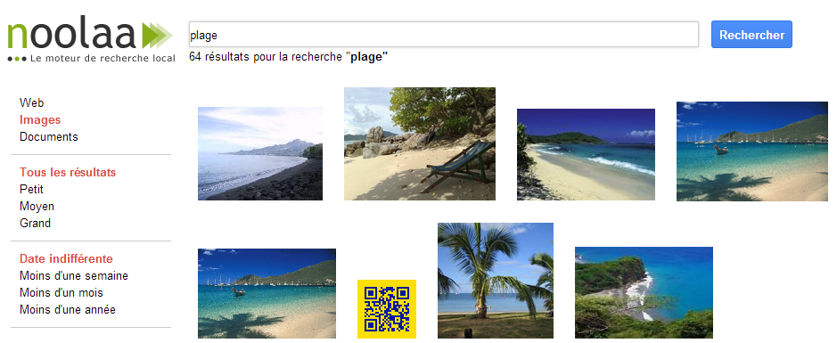

The main concepts discussed in this tutorial are:

* The images to index will be fetched from several web pages
* Two indexes will be necessary:
  * Index 1: to index web pages and the "meta data" (width, height, area) for their images
  * Index 2: to index `alt` texts for images and run full-text searches using these
* Index 2 will be built using the `` tags found when indexing pages in index 1

This tutorial does not explain how to configure web crawling or web pages indexation, since this was covered by previous tutorials.
The prerequisites to follow this document are a/ having an index crawling several web pages and b/ knowing how to work with OSS parsers, analyzers, queries, etc.

# Index 1: full-text search on pages, and images meta-data storage

This index is already configured to crawl, index and search web pages. To index images here are the necessary steps:

*	Create a new `imagesTags` field, which will be used to index every `` tag found by the crawler 
  * Indexed: `yes`, stored: `no`, termvector: `no`
* Configure a new mapping in the HTML parsers to extract the `` tags from the page and store them in the `imageTags` field.
* Configure a mapping in the HTML parser to extract `` tags from the page and store them in the field `imageTags`:
  *	Source: `htmlSource`
  *	Linked in: `imageTags`
  *	Reg. exp.: `(?s)(]* alt="[^"]+"[^>]*>)`

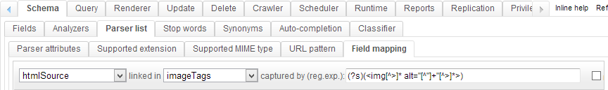

Now every `` tag found on those pages will be stored in the `imageTags` field of our documents. Tags will be stored using this format: ``

HTML parsers will also be able to detect URLs from the `src` attributes (because these are URLs, just like those found in the `href` attribute of a `a` tag). Thus the web crawler will be able to crawl the image directly. We will need to configure a parser to index some information about those images (describing their size).

Index 1 will thus index 2 kinds of documents:

* Web pages, from which `` tags will be extracted and stored in a particular field
* Images, that will be stored with their dimensions but without their `alt` text, because when the image is crawled the `alt` text is not available (it is only written on the page where the image is displayed -- not when you access the image at its own URL).
  * It's in index 2 that we will be able to associate each image to its `alt` text, and use that to run full-text searches on images

To index those images we need to:

* Add some fields in the index:
  *	**fileName**: 
     * Will index the name of the image
     * indexed: `yes`
     * stored: `no`
     * term vector: `no`
  * **imageFormat**: 
     * Will index type of the image (png, jpg, ...)
     * indexed: `yes`
     * stored: `no`
     * term vector: `no`
  * **imageWidth**: 
     * indexed: `yes`
     * stored: `yes`
     * term vector: `no`
     * Analyzer: IntegerAnalyzer
  * **imageHeight**: 
     * indexed: `yes`
     * stored: `yes`
     * term vector: `no`
     * Analyzer: IntegerAnalyzer
  * **imageArea**: 
     * Could be used to search image using predetermined size categories (large, small, ...)
     * indexed: `yes`
     * stored: `no`
     * term vector: `no`
     * Analyzer: IntegerAnalyzer
* Configure analyzer IntegerAnalyzer (tab Schema / Analyzer) as shown:

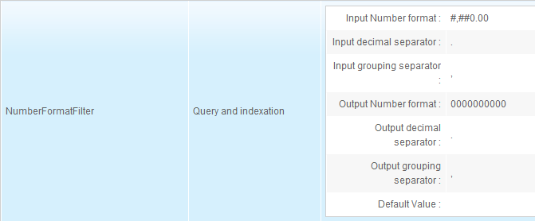

* Configure image parser as shown: 

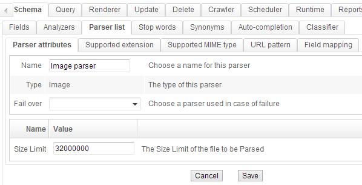

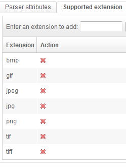

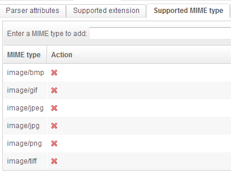

The "Field mapping" will give precise values to each field related to the image:

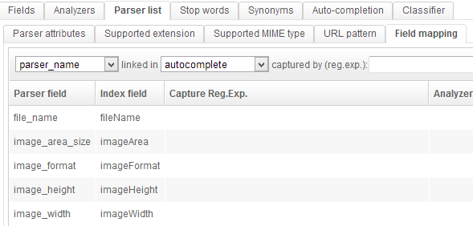

# Index 2: full-text search on images

Index 2 will use `` tags stored in index 1 to create one document by image and associate it to its `alt` text.
We'll see in this document how full information about an image (alt, url, area, format) coming from both indexes can be used in one query.

Create a new index with these fields:

* **imageTag**:
    * Will store the full HTML tag of the image
    * indexed: `no`
    * stored: `yes`
    * term vector: `no`
* **url**:
    * Will store the URL of the page where the image was found
    * indexed: `yes`
    * stored: `yes`
    * term vector: `no`
* **alt**:
    * indexed: `yes`
    * stored: `yes`
    * term vector: position_offsets
    * analyzer: TextAnalyzer
* **src**:
    * indexed: `no`
    * stored: `yes`
    * term vector: `no`
* **imgUrl**:
    * Will store the full URL to the image
    * indexed: `yes`
    * stored: `yes`
    * term vector: `no`

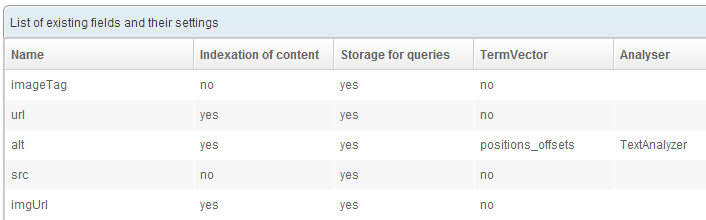

Then comes the part where we use the data from the first index (` tags) to create documents in the second index. This is done using a "job" of the Scheduler.

But first some Analyzers need to be created to:

* extract the `src`
* extrat the `alt`
* build the full absolute URL to the image

In the Schema /Analyzer tab, create 3 new Analyzers:

* **ImageAltAnalyzer**:
  * Tokenizer: KeywordTokenizer
  * Filters:
    * RegularExpressionFilter / Query and Indexation / `alt="([^"]*)"`
    * DecodeHTMLEntitiesFilter / Query and indexation

This analyzer uses a regular expression to get content from the `alt` attribute and then decode those HTML entities it may contain:

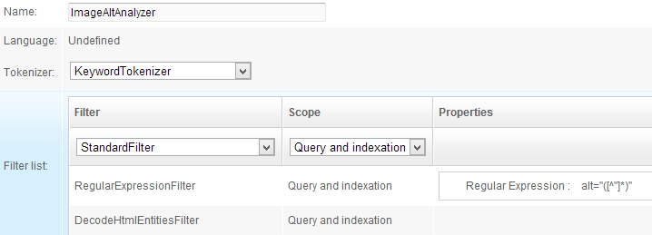

*	ImageSrcAnalyzer: 
  * Tokenizer: KeywordTokenizer
  * Filters:
     * RegularExpressionFilter / Query and Indexation / `(?s)src="([^"]*)"`

This analyzer uses a regular expression to get the content of the `src` attribute:
 

* URLNormalizerAnalyzer 
  * Tokenizer: KeywordTokenizer
  * Filters:
     * URLNormalizeFilter / Query and Indexation

This analyzer builds a full URL for the image from the input data. We will see in a few moments that it takes as its input the URL of the page where the image was found, and the value of the `src` attribute in the `img` tag. A `filter` is used to check whether `src` is relative or absolute, then return an absolute URL.

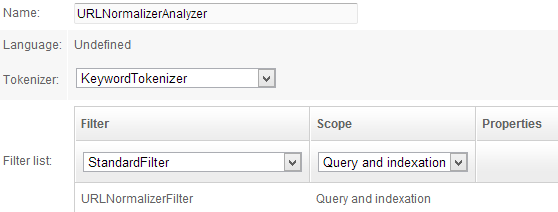

It is now time to configure the data retrieval from the first index using these analyzers.

In the "Scheduler" tab, create a new job.

* Name: **Get images**
  * Active: `Enabled`
  * Cron expression: run every 8 hours: `0 50 */8 * * ? *`
  * Tasks:
    * Add task "Delete all (truncate)"
    * Add task "Pull fields"
      * This task is capable of getting data from another index. We are going to configure it to get every `` tag stored in the first index for each crawled page, and to process those tags with the analyzers we just created in order to create one document per image.
      * Index source: write in the name of the first index
      * Login: a login that can read index 1
      * API Key: API key for the login
      * Source query: use `*:*` to get back all documents
      * Language: Undefined
      * Source field name: `imageTags`
      * Target field name: `imageTag`: this is used to copy every `` tag from the `imageTags` field in index 1 to the `imageTags` field in index 2. `imageTags` is multivalued: **the "Pull fields" task will create 1 document for each value from the `imageTags` field.**
      * Mapped fields on source: `url,url`: this will copy the `url` field from index 1 to the `url` field in index 2
      * Mapped fields on target:
         * `imageTag,alt,ImageAltAnalyzer`
         * `imageTag,src,ImageSrcAnalyzer`
         * `url|src,imgUrl,URLNormalizerAnalyzer`
         * Here we ask for some specific processing on the fields of index 2:
             * `imageTag` is copied into field `alt` after being processed by ImageAltAnalyzer
             * `imageTag` is copied into field `src` after being processed by ImageSrcAnalyzer
             * `url` is concatenated with src using a pipe and is copied to the `imgUrl` field after having been processed by URLNormalizerAnalyzer

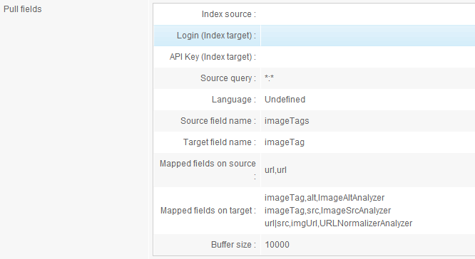

# Building search queries

## Full-text search for images

As previously discussed, the full-text search for images is done using `alt` descriptive texts. Those values are stored in index 2: thus it is this index that must be used for querying.

However, index 1 also stores useful information about the images (name, area, size). We will configure a join between the two indexes for the search query to also fetch these.

### Index 2

4 queries must be created in index 2. The first one will search for every image, and the other three will be used to filter on image size.
 
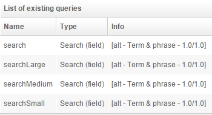

**Query "search":**

Returned fields:

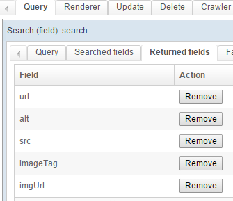
 
At this point, a collapsing process must be configured in order to remove duplicated images. When images were indexed, the "Pull fields" task could have fetched the same image several times, possibly with different `alt` contents.
Here is such a collapsing process on the `imgUrl` field:

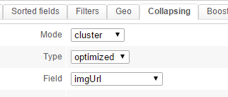

We also configure a join on index 1 to get back more information about the image:

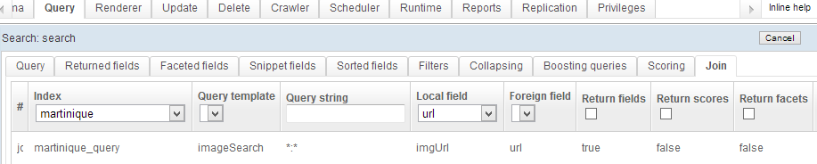

### Index 1

On index 1 four queries must also be created, they will be used in the joins made in the queries in index 2.

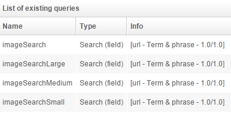
 
**Query "imageSearch":**

Returned fields:

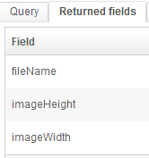

Here a filter is used to remove the very small images:

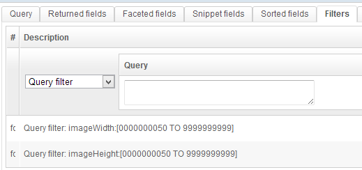

## Search images by size

### Index 2

The "searchLarge" query is the same as the "search" query except for its join: here it is the "imageSearchLarge" query used for joining index1.

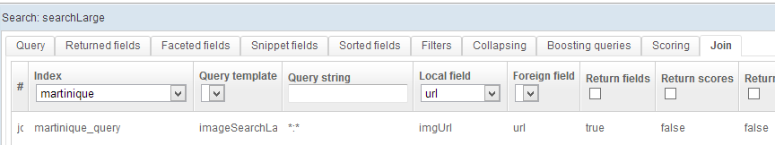

### Index 1

The "imageSearchLarge" query is the same as the "imageSearch" query with one more filter on the "imageArea" field: 

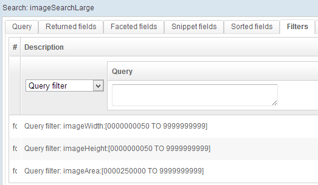

Filters for the "imageSearchSmall" and "imageSearchMedium" queries will be built in the same way using appropriate values:

_**Medium:**_

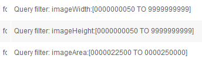
 
_**Small:**_

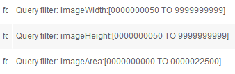
