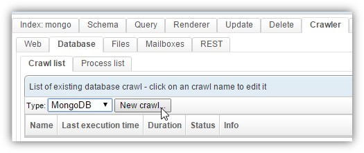
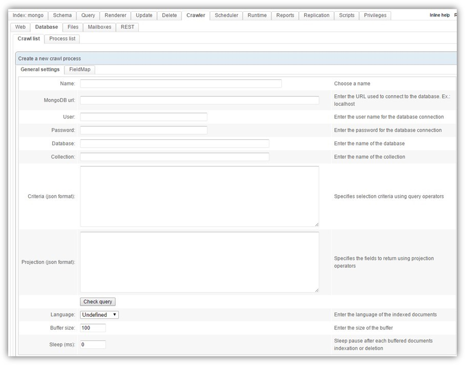
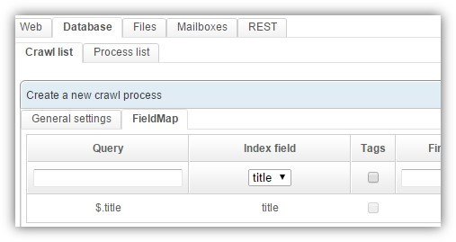
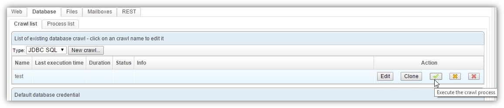

## How to crawl a MongoDB server

Starting with version 1.5.10, OpenSearchServer can crawl a MongoDB server.

### Creating the crawl process

Go to tab Crawler / Database, choose `MongoDB` in the select list `Type` and click the button `New crawl...`:

This crawler looks a bit like the [Database crawler](http://www.opensearchserver.com/documentation/tutorials/crawling_a_database.md). It has two tabs: 

* the first tab (`General settings`) is for **configuring access to the MongoDB, and setting some indexation parameters**,
* the second tab (`FieldMap`) is for **defining the relations between information retrieved from the MongoDB and the fields** of your schema.

### Configuring the crawl process

`MongoDB url` must follow this format: `mongodb://XX.XX.XX.XX:<port>`.

The `Criteria` and `Projection` parameters are the ones **defined by the `find` function** of MongoDB: [http://docs.mongodb.org/manual/reference/method/db.collection.find/](http://docs.mongodb.org/manual/reference/method/db.collection.find/).

For example, you could use `{ _id:1, title:1}` for the parameter `Projection`.

### Indexing data into fields

The `FieldMap` tab uses [JSONPath](http://goessner.net/articles/JsonPath/) for **targetting precise properties** within the returned object. 

For example, use `$._id.$oid` and `$.title` to target the object id and the title of the document.

As usual, configure **which value should go in which field** of your schema. 

### Starting the crawl

To start the crawl, simply click the button with the green icon in the processes list:

This crawl can also be **started from a job** in the scheduler, using the `Database crawler - run` task.

