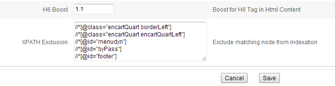

## How to exclude part of a Web page from being crawled

OpenSearchServer allows you to exclude certain parts of a webpage from being crawled.

### Excluding content using opensearchserver.ignore CSS class

The content of any HTML tag with the class `opensearchserver.ignore` will be ignored while crawling.

The `opensearchserver.ignore` class can also be stacked with your existing CSS classes.

Example :

    
This div will not be indexed in OpenSearchServer.

    
This content div will not be indexed in OpenSearchServer.

### Excluding content using XPATH requests

HTML parsers allows exclusion of some parts of webpages _via_ XPATH requests. This option can be found in Schema > HTML Parser > Parser Attributes > XPATH Exclusion, at the bottom of the page. One XPATH request can be written by line.

Parts of webpage matched by these requests will be totally ignored by HTML parser.

