## How to extract specific information from web pages

The default index template `web crawler` automatically extracts set data from web pages: title, content, url, meta keywords and description, and so on.

But **it is sometimes useful to extract more specific information** and store it within specific fields. 

### Extracting information using a HTML parser

Here is an imaginary e-commerce website :

---

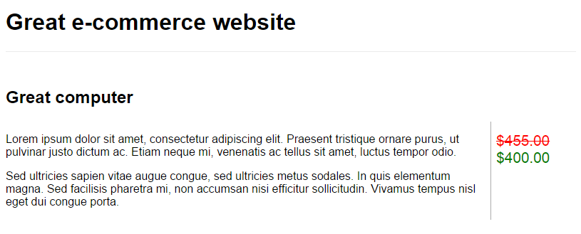

---

This page contains two specific bits of information, which we would like to index :

* product name: `Great computer`
* product price: `$400.00`

First, let's create two fields in the index's schema to store the information:

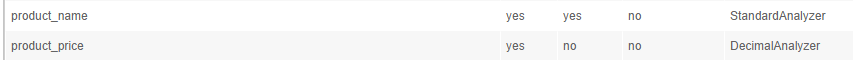

The next step is to customise the HTML parser. This takes place in the OSS tab `Schema` / `Parser list`.

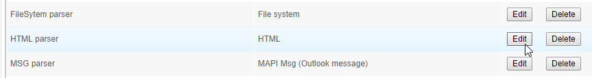

Specifically, the `Field mapping` tab shows how information from the built-in HTML parser is assigned to fields within the schema.

When exploring a page, the web crawler hands over the data to the HTML parser. The HTML parser isolates the following so it can be used in **fields mappings** -- title, generated title, body, meta_keywords, meta_description, meta_robots, internal_link, internal_link_nofollow, external_link, external_link_nofollow, lang, htmlProvider and htmlSource. `htmlSource` is the full HTML source code of the web page.

In our example we will map **information `htmlSource`** to a field of the schema. Since what we need is a specific part of the source code, we are going to use **a [regular expression](http://www.regular-expressions.info/) to restrict extracted data**.

Let's have a look at the source code of our imaginary web site :

```html
<html>
<head>
<title>My e-commerce page</title>
<style type="text/css">
	[...]
</style>
</head>
<body>
	<header>
		<h1>Great e-commerce website</h1>
	</header>
	<div id="product">
		<h2>Great computer</h2>
		<div id="product-description">
			<p>Lorem ipsum dolor sit amet, consectetur adipiscing elit. Praesent tristique ornare purus, ut pulvinar justo dictum ac. Etiam neque mi, venenatis ac tellus sit amet, luctus tempor odio.</p>
			<p>Sed ultricies sapien vitae augue congue, sed ultricies metus sodales. In quis elementum magna. Sed facilisis pharetra mi, non accumsan nisi efficitur sollicitudin. Vivamus tempus nisl eget dui congue porta. </p>
		</div>
		<div id="product-prices">
			<div id="old-price">$455.00</div>
			<div id="price">$400.00</div>
		</div>
	</div>
</body>
</html>
```

First, the mapping to extract the product name:

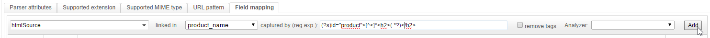

An efficient regular expression to extract the needed data from the page's code is: `(?s)id="product">[^<]*<h2>(.*?)</h2>`.

Second, the mapping to extract the product's price:

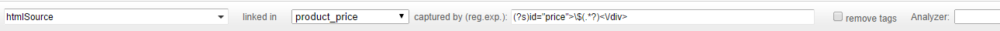

Our suggested regex would be: `(?s)id="price">\$(.*?)<\/div>`.	

Third, add the two new mappings:

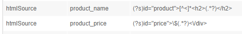

Click the `Save` button at the bottom of the page to save this HTML parser.

This can be tested quickly by going to the `Crawler` / `Web` / `Manual crawl` tab. Enter the test page's URL and click the `Crawl` button. From the crawl data, the parser extracts the product name and price:

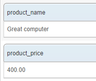

### Extracting information using a crawler and Analyzers

There are cases where the necessary data is part of the URL. The problem is, the URL isn't handled by the HTML parser - it is the web crawler that manages this information.

Let's assume that the URL of our imaginary web page is `http://great-ecommerce-website.com/products/great-computer-4536GE7.html`. The `4536GE7` string is the product reference. So our next example project will be to extract and index it.

Create a new field within the index's schema:

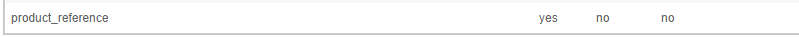

In the `Crawler` / `Web`  / `Field mapping` tab, add a mapping between the `url` information and this new field:

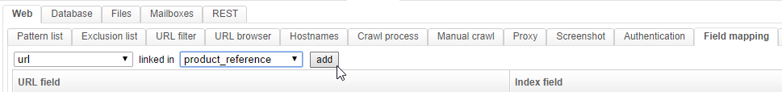

This tab plays the same role as the `Field mapping` tab of the HTML parser. However, the information is different since it comes from the web crawler. It thus includes the url, the crawl date, the headers, etc.

Once the mapping is done, the `product_reference` field will be populated by URLs. This is a great start, but we need to get rid of most of the URL to only keep the product reference string.

Go to the `Schema` / `Analyzers` tab and create a new Analyzer as shown:

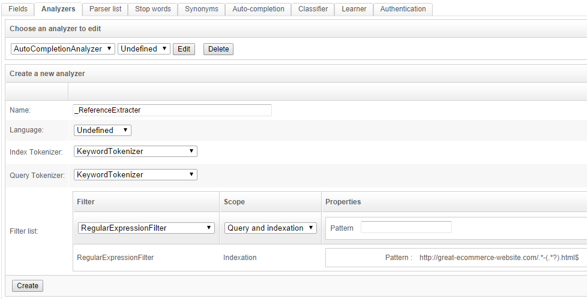

This analyzer will also  **use a regular expression** (namely `http://great-ecommerce-website.com/.*-(.*?).html$`) to parse down the URL to the product reference. **It can be tested immediately** from the "Analyzer test" section:

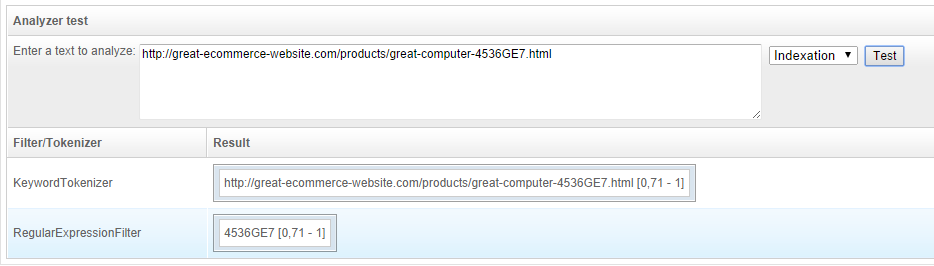

Don't forget to click the `Create` button. Go to the `Schema` / `Fields` tab, click on the previously-created `product_reference` field and **configure it to use the new analyzer**:

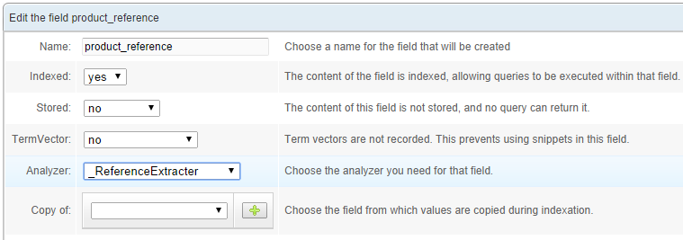

Re-crawl the example page. You can use `Manual crawl` for this one too. However, **be aware that** the analyzers' results are not shown by the `Manual Crawl` feature.

`Manual Crawl` only shows the raw results from field mappings made by crawlers or parsers. The further transformations applied by indexation processes will not appear. To see the proper indexed values, you must query the index:


