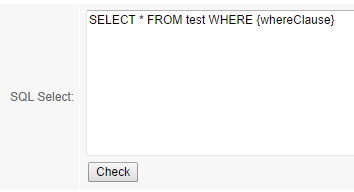
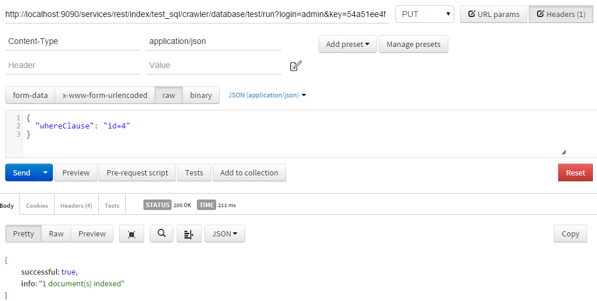
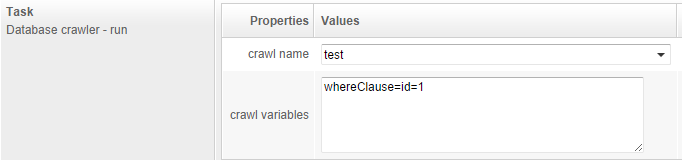
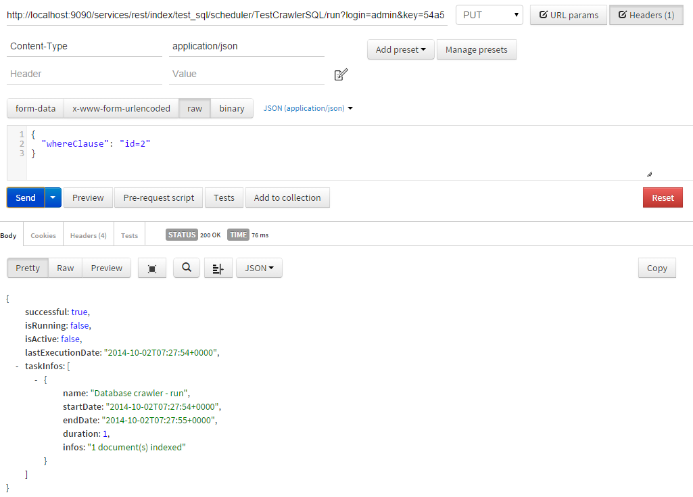

## How to use variables with Database Crawler

OpenSearchServer's database crawler is a powerful feature allowing to crawl several types of database using an SQL query.

This SQL query can contain some variables whose values will be set on execution time.

### Defining variables in SQL query

In SQL query, variables can be used anywhere. They must be written with this format: `{variableName}`. 

For example:

### Giving variables some values

When using variables in SQL query it is of course necessary to give them value before using the database crawler, otherwise OpenSearchServer will use the variables names as given in the SQL query and this will cause a failure. 

There are 2 ways of setting variables.

#### Set variables using REST API for Database Crawler

A REST API to execute crawler for database exists. Here is how it must be called:

* HTTP Method: **PUT**
* Header: **Content-type:application/json**
* URL: `.../services/rest/index/<index name>/crawler/database/<crawl name>/run?login=<login>&key=<API key>`

Variables are defined in request's data, using a JSON array:

    {
      "whereClause": "id=2"
    }

Here is an example using Chrome's extension Postman:

#### Set variables using Scheduler

OpenSearchServer's scheduler can be used to run some database crawler. Task `Database crawler - run` must be used here. Variables have to be written one by line in field `crawl variables`, with this format: `variableName=replacement`.

For example:

##### Running a job of scheduler using REST API

Jobs of scheduler can be started by API calls. Variables can be passed as a JSON array.

Here is an example using Chrome's extension Postman:

### Giving variable an empty value

To give variable empty value one has to set them with empty string. 

For example in JSON:

    {
      "whereClause": ""
    }

Or in scheduler's task `Database crawler - run`:

    whereClause=

