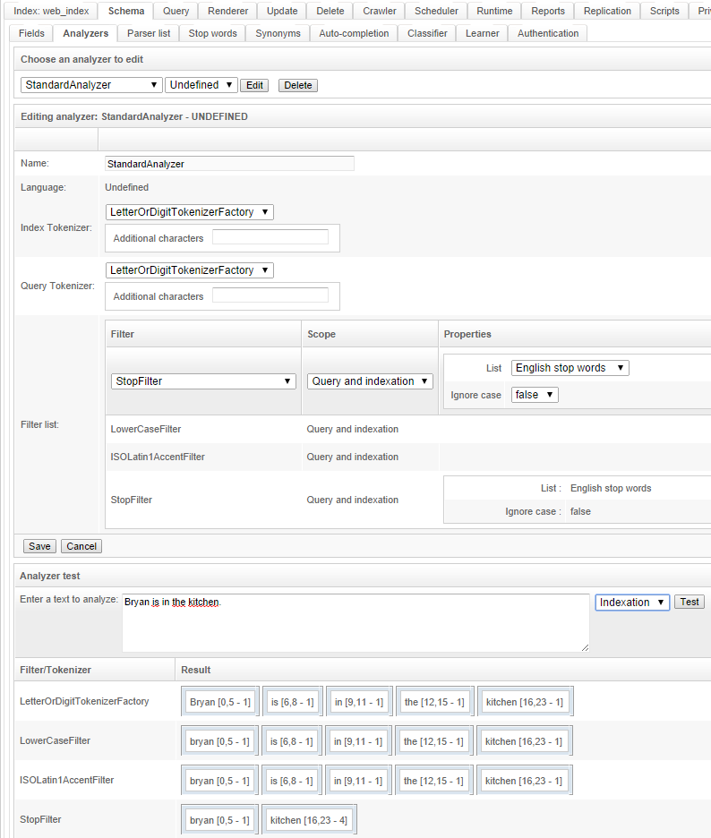
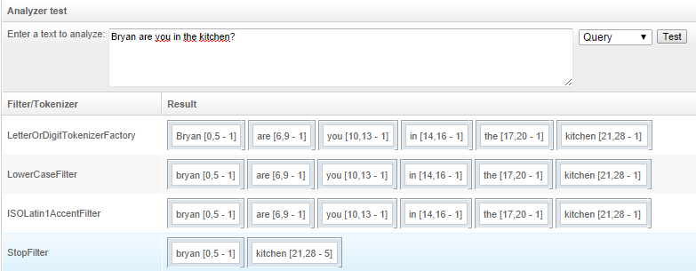

## How to set up stop words

`Stop words` are an easy way to prevent some words from being indexed. They are not automatically enabled in OpenSearchServer though.

To set up this feature one has to:

1. Add a `StopFilter` to an analyzer
2. Configure a field with this analyzer

And that's it! Quite easy. Here are some more details about this.

Analyzer are used to process data during indexing process, or at query time. They do a lot of jobs in a search engine. They are for example responsible for splitting sentences in words (or `tokens`), and for stemming words, allowing searches to be more efficient.

Some Analyzers already exist in OpenSearchServer, like the `StandardAnalyzer`. One can decide to add a `StopFilter` to this analyzer so that every field using this analyzer would also benefit from the `stop words` feature. 

This screenshot shows what would be indexed for sentence `Bryan is in the kitchen` on a field which would use a `StandardAnalyzer` enhanced with a `StopFilter`:

Final remaining tokens are `bryan` and `kitchen`. Tokens `is`, `in` and `the` have been removed by the Stop Words feature, since those words were listed in the `English stop words` list.

This feature can for example allow matching of a document with title `Bryan is in the kitchen` when search keywords are `Bryan are you in the kitchen?`, since final tokens for this query would also be `bryan` and `kitchen`, as shown by this screenshot:

Of course this feature may have some other goals, like blocking indexing of swear words.

### Managing list of stop words

Several stop words lists can be easily created in OpenSearchServer. Lists are managed in tab `Schema` / `Stop words`. Stop words must be written one by line.