## How to use analyzers

Analyzers are an essential part of OpenSearchServer. They are responsible for processing text data both during indexation and when executing queries. Typical processes include:

* Splitting sentence into words
* Extracting specific strings of text based on a pattern (defined by a regular expression)
* Filtering words out
* Enabling use of synonyms
* Stemming words
* Converting units
* Transforming text into numbers
* And many others

### Structure of an analyzer

3 main properties define an analyzer:

1. The language of documents it will process. This can be set to `Undefined` so the analyzer can apply to every document.
2. Which tokenizer to use when indexing documents, and when querying. Tokenizers split an input text into `tokens` - see below.
3. A list of filters to be used to process input text.

Analyzers are then used in several contexts:

* They can be configured as part of an index's schema, to be used for a particular field. A field in the schema can only be processed by a single analyzer.
* They can be deployed as a parser when mapping fields.

### What are `tokens`

`Tokens` are the elementary pieces of information indexed within fields, or processed when querying an index. It is important to understand that when searching an index OpenSearchServer actually reasons using `tokens`. It compares the tokens within the query to the tokens indexed within the fields.

For instance: a document titled "Red cars" will have the values `red` and `car` in its field `title` because this field uses a `TextAnalyzer`. If a query for "red car" is run this document will match - since the tokens `red` and `car` will be found in this document. A search for "red cars" will also match this document - because at query time the `TextAnalyzer` is applied to the input text, boiling it down to the tokens `red` and `car`.

### Role of an analyzer

Analyzers thus break down an input text into `tokens`. These tokens are what actually gets indexed in the corresponding field (when the analyzer is deployed during indexing) and what actually gets used in search queries (when the analyzer is deployed during querying).

#### At indexing time

When documents are indexed the fields of the schema get populated by values, as defined by `mappings`. These `mappings` can be defined in several parts of the OSS GUI - for example in the `Field mapping` tab of the web crawler and the `Field mapping` tab of the HTML parser.

If these fields are configured to index data (i.e. their property `Indexed` was set to `yes`) then two cases may occur:

1. The field is not set to use any analyzer. The full text will be indexed as a single `token` without any transformation.
2. The field is configured to use an analyzer. The text is handed over to this analyzer, who renders it into `tokens`. These `tokens` are then indexed.

Here is an example: for a field called `title`, and for a document named "Planet Of The Apes", the indexed tokens will be:

1. In case #1 (no analyzer): `Planet Of The Apes`.
2. In case #2 (using a `TextAnalyzer`): `planet`, `of`, `the`, `ape`.

#### At query time

The same behaviour occurs when querying the index. The search keywords are fed to the analyzer configured for each field of the query, and the resulting tokens are what gets actually used in the final query to the index.

Running with the same example as above, a query for `"Planet of the apes"` on the field `title` would result in the actual query:

1. In case #1: `title:"Planet of the apes"`
1. In case #2: `title:"planet of the ape"`

---

### List of available tokenizers

Several tokenizers are available in OpenSearchServer. They differ in how they split sentences into tokens: some of them will split upon encountering a white space, others upon encountering some special characters, etc.

In our examples, we will use the sentence "A two-hours walk to London.".

#### StandardTokenizer

This one splits sentences along white spaces, periods and semicolons but keeps some others (like single quote marks).

_Example:_
    
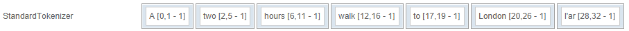

#### LetterOrDigitTokenizerFactory

This one splits sentences along any character that isn't a letter or a digit. This includes white spaces, quotes, periods, etc. This tokenizer provides a field called "Additional characters" that can be used to white-list further characters.

_Example where "Additional characters" contains `-`:_
	
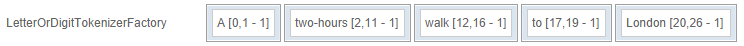
#### KeywordTokenizer

This one does not split sentences at all.

_Example:_

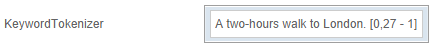
#### WhitespaceTokenizer

This one only splits sentences when encountering a white space.

_Example:_
	
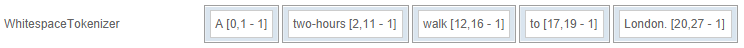

#### NGramTokenizer

This one splits sentences into groups of characters, called "ngram". The fields `Min gram size` and `Max gram size` are used to configure the minimum and maximum number of characters allowed in such a group.

_Example with `Min gram size` = 2 and `Max gram size` = 3. First tokens only are shown here:_
	
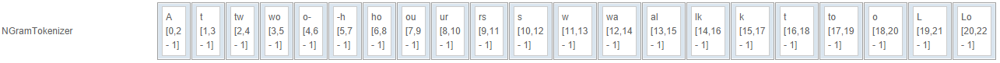

#### EdgeNGramTokenizer

This one splits sentences into groups of characters, but in only one direction - either from the beginning ("front") of the sentence to its end, or from the end ("back") to its beginning. The fields `Min gram size` and `Max gram size` are used to configure the minimum and maximum number of characters allowed in these groups.
 
_Example with `Min gram size` = 1, `Max gram size` = 10 and `Edge side` = front:_
	
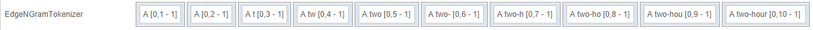

---

### Presentation of some filters

OpenSearchServer comes with many useful filters that can be attached to analyzers. Here is a selection:

#### DecodeHtmlEntitiesFilter

Decodes characters encoded as HTML entities. 

_Example:_

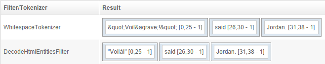

#### DomainFilter

Extracts the domain from a whole URL. It can be set to only extract the TLD (say, the `com` in `http://editions.cnn.com`), only extract the host name (`cnn`), extract both the hostname and TLD (`cnn.com`), or the TLD, hostname, and hostname and TLD (`com`, `cnn.com`, `editions.cnn.com`).

The following example is set with the `domain.tld only` option:

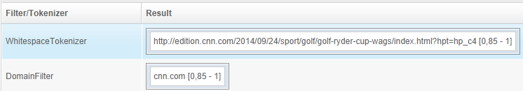

#### ElisionFilter

Removes elisions. Its list of elisions can be configured.

_Example using the French sentence `l'autre m'appelle l'idiot, c'est grossier`:_

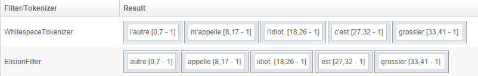

#### EdgeNgramFilter

Creates ngram starting from one side (back or front) of the tokens. The available parameters are the minimum and maximum size of ngram, and which side to use. 

_Example with min size = 1, max size = 20 and side = Front:_ 

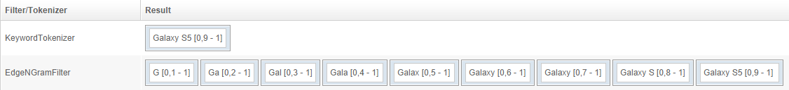

This filter is particularly useful when building suggestions for an auto-completion feature.

#### ExpressionLookupFilter

Keeps tokens that are found in a list. Such lists can be created in the `Schema` / `Stop words` tab. 

_Example using the default list of English stop words:_

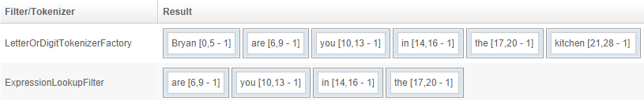

This filter may be used for extracting specified keywords from a text.

#### IsoLatin1AccentFilter

Removes diacritical accents. 

_Example:_

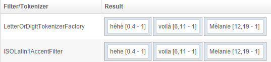

#### LowerCaseFilter

Puts text in lower case.

_Example:_

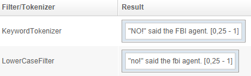

#### NGramFilter

Creates ngram.

_Example with `Min gram size` = 2 and `Max gram size` = 4 (first ngrams only are shown):_

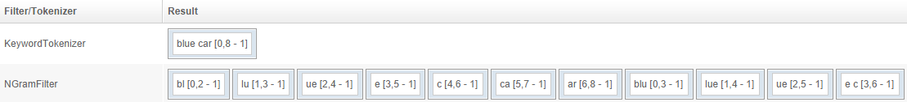

#### NumberFormatFilter

Transforms numbers into a format that OpenSearchServer can understand. In OpenSearchServer all data is text data, including digits. When indexed, numbers must be prefixed with a `0` to be properly processed when sorting or scoring.

For example: the number `110` may well be greater than the number `20`, but alphabetically `"20"` will be sorted after `"110"`, since `2` comes after `1`. However, if numbers get prefixed with one or more `0` these two will be transformed into `00110` (two 0s) and `00020` (three 0s). This allows correct sorting to take place: `"00020"` will come before `"00110"`.

To differentiate between positive and negative numbers, another prefix is necessary. For instance `<` and `>` will work (respectively denoting negative and positive numbers), since alphabetically `<` comes before `>`.

A full configuration for NumberFormatFilter will be:

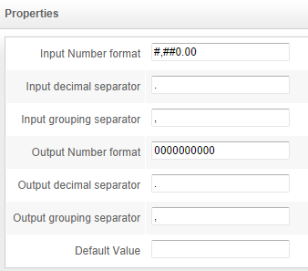

Giving these results:

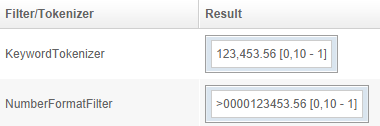

#### RegularExpressionFilter

Applies a [regular expression](regular-expressions.info) and keeps [captured groups](http://www.regular-expressions.info/brackets.html).

_Example using the regexp `product-([0-9]*).php`:_

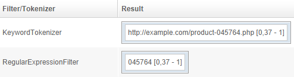

#### RegularExpressionReplaceFilter

Applies a [regular expression](regular-expressions.info) and allow re-use of the [captured groups _via_ backreferencing](http://www.regular-expressions.info/refcapture.html).

_Example using the regexp `^(.*?)thumbnail\/10x60(.*?)$` and the replacement `$1images$2`:_

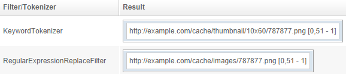

#### ShingleFilter

Creates shingles, which are groups of words.

_Example with the token separator being a white space, `Max shingle size` = 4 and `Min shingle size` = 1:_

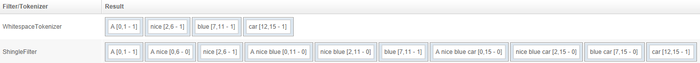

#### StopFilter

Removes terms if they can also be found in a list. These lists can be managed in the `Schema` / `Stop words` tab.

_Example using the default English list of stop words:_

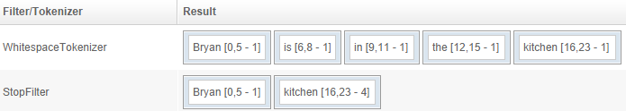

See the [How to set up stop words page](how_to_set_up_stop_words.md) for more information.

#### YouTubeFilter and DailymotionFilter

These filters use APIs from YouTube and DailyMotion to get information about a video based on its URL. 
See the [How to parse YouTube URLs and extract data page](../parsing/how_to_parse_YouTube_URLs_and_extract_data.md) for more information.
