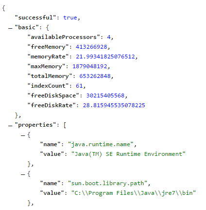
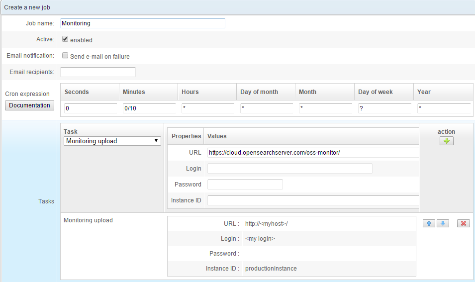

## How to monitor an OpenSearchServer instance

### Using API calls

You can call a dedicated API to get monitoring information about your instance.

Simply make a `GET` request on `http://<host>:<port>/services/rest/monitor/json?full=true`.

This provides such useful data as free disk space, memory use, etc.



If you only want basic information do not send the `?full=true` parameter.
If you want to get results in XML instead of JSON use `http://<host>:<port>/services/rest/monitor/xml?full=true`.

### Using OpenSearchServer to regularly post monitoring data to an URL

_**This requires OpenSearchServer > 1.5.10**_

Using the _Scheduler_ you can quickly set up a task that regularly posts monitoring information to a particular URL.

To do so:

* Go to the Scheduler tab
* Click "Create new scheduler job"
	* Give a name to the job
	* Check the **`Enabled` checkbox**
	* Configure a CRON expression, following these guidelines: [http://www.quartz-scheduler.org/documentation/quartz-2.x/tutorials/crontrigger](http://www.quartz-scheduler.org/documentation/quartz-2.x/tutorials/crontrigger)
	* Add one task: `Monitoring upload`
		* **This task perfoms a `POST` request to the given URL.** 
		* HTTP authentication can be used with the parameters `Login` and `Password`. 
		* The body of the request will be a **text string with all monitoring information concatenated**. 
		* An additionnal detail called `Instance ID` can be added to the body of the request. This can be useful for example to identify the instance making the request.
		* Here is a truncated example of the body of a request:
 
```  
instanceId=productionInstance&version=OpenSearchServer+v1.5.10-SNAPSHOT+-+build+98d156cdbb&availableProcessors=4&freeMemory=424985328&freeMemoryRate=22.61705313410078&maxMemory=1879048192&totalMemory=698875904&indexCount=61&freeDiskSpace=30216572928&freeDiskRate=28.81705882750464&dataDirectoryPath=E%3A%5CCopensearchserver%5Cdata&property_java_runtime_name=Java%28TM%29+SE+Runtime+Environment...
```

Here is an example of a job that will make a `POST` request every 10 minutes:


