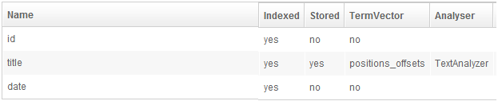
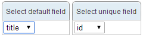
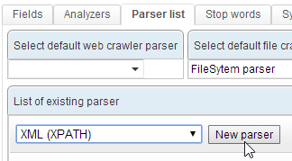
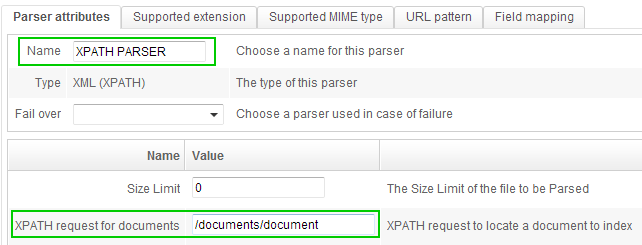
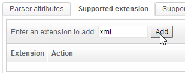
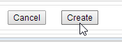
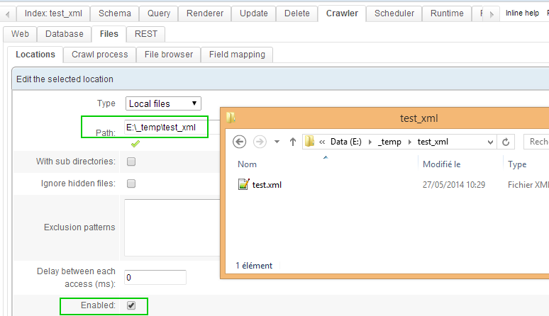
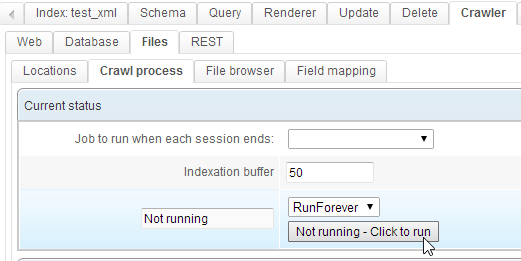
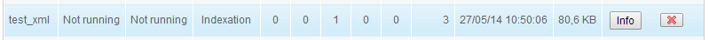
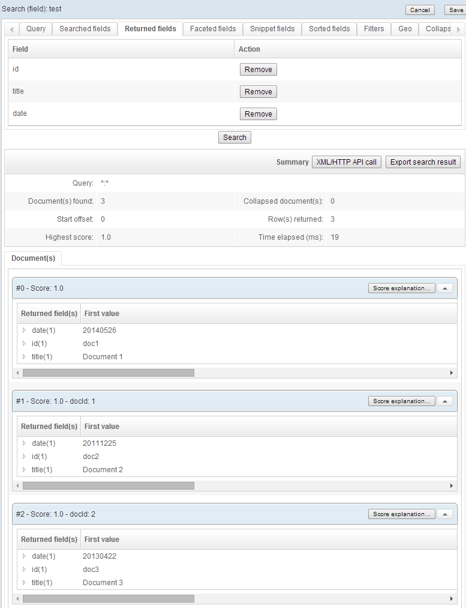

# XML file

In this example, we have one file containing three documents. Our goal is to create one document in the index for each document in the file.

# Schema

Our schema has 3 fields :
  

# Parser

Delete any existing parser handling XML files. In this example, the default « XML » parser gets deleted:

Create a new « XML (XPATH) » parser :

 
Name this new parser and write « /documents/document » in the field « XPATH request for documents » - since this is the XPATH request to access each document:

 
In the tab « Supported extension », add « xml » :

 
In the tab « Supported MIME type », add handling for the following types :
* application/xhtml+xml
* application/xml
* text/xml

In the tab « Field mapping », configure this mapping :
 

This tells the parser to fetch :
* /documents/document/date into the « date » field
* /documents/document/id into the « id » field
* /documents/document/title into the « title » field

Click « Create » :

 
# Crawl the file

In this example, we place the file in a folder then configure a new file crawler :

 
We launch the crawler :

 
The file is now indexed. Check the information about the index on the main page:
 

The index now includes three documents.

# Query documents

A query template can be quickly created to see documents:

