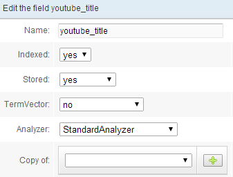
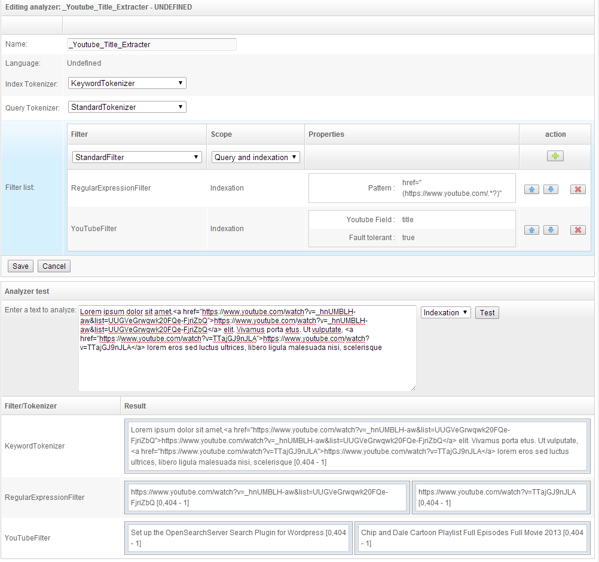
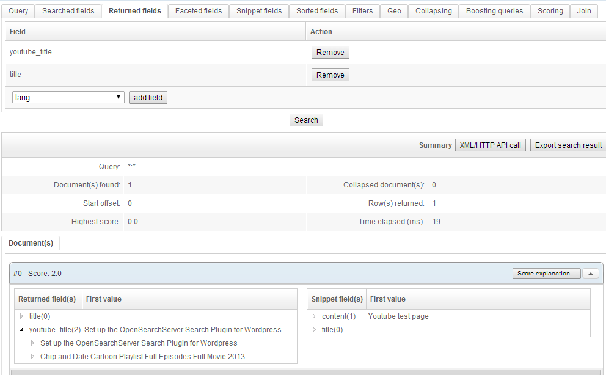
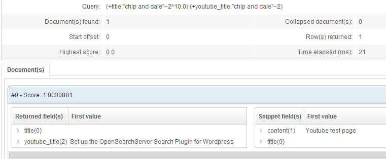

## How to parse YouTube URLs and extract data 

Here are required steps to implement a way to work with YouTube extraction:

* Create a new field to index, for example, video's title.
 

 
* Create a new analyzer

* Take care to choose KeywordTokenizer for indexation.
* You can see in the test section at the bottom how it works: filter `YouTube filter` will make calls to YouTube's API in order to retrieved some information about YouTube's videos found in analyzed text. Links to these videos are found with a regular expression.

* In the HTML parser add a mapping between `htmlSource` and your new field, and use the new created analyzer on this mapping. This will automatically extract any YouTube's links from full HTML source of webpages.

 
* You can then index some pages containing links to youtube's videos. Videos's titles will be extracted and indexed in new field.

As you can see in this example there are two titles in one document, because the indexed page contained two links to Youtube.
 

If one search directly for a video title, document is found as well, since it has been properly tokenized by the StandardTokenizer set on the field :

