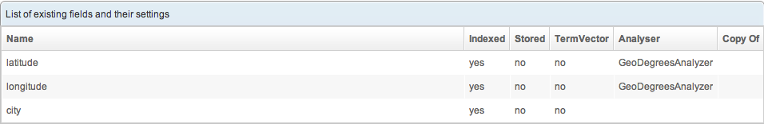

<<<<<<< HEAD
OpenSearchServer supports Geolocation requests. By embedding the coordinates (longitude and latitude) in the indexed documents, it is possible to filter a result on the documents which are in a defined rectangle.

## Index your document with Geolocation information

### Prepare the schema

Before being able to apply geospatial queries, you have to provide the latitude and the longitude of the document.

The schema should contains two fields which will hold these informations:

- latitude (indexed) 
- longitude (indexed)

Choose the analyzer corresponding to the [coordinate system](http://en.wikipedia.org/wiki/Geographic_coordinate_system):

- GeoRadianAnalyzer
- GeoDegreesAnalyzer

### Index the data

The coordinate (latitude and longitude) are supposed to be expressed in decimal format:

- For Degrees: -52.090904
- For Radian: -0.675757575575

#### Using the API, just add the two fields on your JSON document

The [JSON indexing API](https://github.com/jaeksoft/opensearchserver/wiki/Document-put-JSON) is documented on our [API wiki](https://github.com/jaeksoft/opensearchserver/wiki/)

    [
      {
        "lang": "ENGLISH",
        "fields": [
          { "name": "city", "value": "New-York" },
          { "name": "latitude", "value": 40.7142700 },
          { "name": "longitude", "value": -74.0059700 }
        ]
      },
      {
        "lang": "FRENCH",
        "fields": [
          { "name": "city", "value": "Paris" },
          { "name": "latitude", "value": 48.8534100 },
          { "name": "longitude", "value": 2.3488000 }
         ]
       },
       {
        "lang": "GERMAN",
        "fields": [
          { "name": "city", "value": "Berlin" },
          { "name": "latitude", "value": 52.5243700 },
          { "name": "longitude", "value": 13.4105300 }
         ]
       }
    ] 

### Make a query

On our example, we want to find a city located around 10 kilometers of a given position.

The latitudeField and longitudeField are mapped to the fields of the schema.

The "geo" part contains the central position.

The "GeoFilter" applies a  geographical filter following the given parameters.

Just make a geo located search using the [Search(Field) API](https://github.com/jaeksoft/opensearchserver/wiki/Search-field) described on [our API wiki](https://github.com/jaeksoft/opensearchserver/wiki/):

    {
        "start": 0,
        "rows": 10,
        "geo": {
            "latitudeField": "latitude",
            "longitudeField": "longitude",
            "latitude": 48.85341,
            "longitude": 2.3488,
            "coordUnit": "DEGREES"
        },
        "emptyReturnsAll": true,
        "filters": [
            {
                "type": "GeoFilter",
                "shape": "SQUARED",
                "negative": false,
                "unit": "KILOMETERS",
                "distance": 10
            }
        ],
        "returnedFields": [ "city", "latitude", "longitude" ]
    }

### Document returned

And here are the document found.

    {
    "successful": true,
    "documents": [
        {
            "pos": 0,
            "score": 1,
            "collapseCount": 0,
            "fields": [
                {
                    "fieldName": "city",
                    "values": [
                        "Paris"
                    ]
                },
                {
                    "fieldName": "latitude",
                    "values": [
                        "P0.8526529"
                    ]
                },
                {
                    "fieldName": "longitude",
                    "values": [
                        "P0.0409943"
                    ]
                }
            ]
        }
    ],
    "facets": [],
    "query": "*:*",
    "rows": 10,
    "start": 0,
    "numFound": 1,
    "time": 126,
    "collapsedDocCount": 0,
    "maxScore": 1
    }

### Add distance in returned documents

To add distance between the searched coordinates and each documents a "scorings" array is needed in the query:

    {
        "start": 0,
        "rows": 10,
        "geo": {
            "latitudeField": "latitude",
            "longitudeField": "longitude",
            "latitude": 48.85341,
            "longitude": 2.3488,
            "coordUnit": "DEGREES"
        },
        "emptyReturnsAll": true,
        "filters": [
            {
                "type": "GeoFilter",
                "shape": "SQUARED",
                "negative": false,
                "unit": "KILOMETERS",
                "distance": 10
            }
        ],
        "returnedFields": [ "city", "latitude", "longitude" ],
        "scorings": [
            {
                "ascending": false,
                "weight": 1,
                "type": "DISTANCE"
            }
        ]
    }

Here are the results:

    {
    "successful": true,
    "documents": [
        {
            "pos": 0,
            "score": 1,
            "distance": 0.00033325536,
            "collapseCount": 0,
            "fields": [
                {
                    "fieldName": "city",
                    "values": [
                        "Paris"
                    ]
                },
                {
                    "fieldName": "latitude",
                    "values": [
                        "P0.8526529"
                    ]
                },
                {
                    "fieldName": "longitude",
                    "values": [
                        "P0.0409943"
                    ]
                }
            ]
        }
    ],
    "facets": [],
    "query": "*:*",
    "rows": 10,
    "start": 0,
    "numFound": 1,
    "time": 0,
    "collapsedDocCount": 0,
    "maxScore": 0
    }
=======
OpenSearchServer supports geolocation requests. Once coordinates (longitude and latitude) have been embedded within indexed documents, it is possible to filter these based on whether they lie within a defined geographic rectangle.

## Indexing your document with Geolocation information

### Preparing the schema

First, provide the latitude and the longitude of the document.

The schema should include two fields to hold this information:

- latitude (indexed) 
- longitude (indexed)

Choose the analyzer corresponding to the [coordinate system](http://en.wikipedia.org/wiki/Geographic_coordinate_system):

- GeoRadianAnalyzer
- GeoDegreesAnalyzer

### Indexing the data

The coordinates (latitude and longitude) should expressed in decimal format. Examples:

- For Degrees: -52.090904
- For Radians: -0.675757575575

#### Using the API, just add the two fields on your JSON document

The [JSON indexing API](https://github.com/jaeksoft/opensearchserver/wiki/Document-put-JSON) is documented on our [API wiki](https://github.com/jaeksoft/opensearchserver/wiki/).

    [
      {
        "lang": "ENGLISH",
        "fields": [
          { "name": "city", "value": "New-York" },
          { "name": "latitude", "value": 40.7142700 },
          { "name": "longitude", "value": -74.0059700 }
        ]
      },
      {
        "lang": "FRENCH",
        "fields": [
          { "name": "city", "value": "Paris" },
          { "name": "latitude", "value": 48.8534100 },
          { "name": "longitude", "value": 2.3488000 }
         ]
       },
       {
        "lang": "GERMAN",
        "fields": [
          { "name": "city", "value": "Berlin" },
          { "name": "latitude", "value": 52.5243700 },
          { "name": "longitude", "value": 13.4105300 }
         ]
       }
    ] 

### Querying

Example: let's find a city located within 10 kilometers of a given point (the "central position").

The latitudeField and longitudeField are mapped to the fields of the schema.

The "geo" part contains the central position.

The "GeoFilter" applies a geographical filter following the provided parameters.

Just make a geolocated search using the [Search(Field) API](https://github.com/jaeksoft/opensearchserver/wiki/Search-field) described on [our API wiki](https://github.com/jaeksoft/opensearchserver/wiki/):

    {
        "start": 0,
        "rows": 10,
        "geo": {
            "latitudeField": "latitude",
            "longitudeField": "longitude",
            "latitude": 48.85341,
            "longitude": 2.3488,
            "coordUnit": "DEGREES"
        },
        "emptyReturnsAll": true,
        "filters": [
            {
                "type": "GeoFilter",
                "shape": "SQUARED",
                "negative": false,
                "unit": "KILOMETERS",
                "distance": 10
            }
        ],
        "returnedFields": [ "city", "latitude", "longitude" ]
    }

### Document returned

Here are the results.

    {
    "successful": true,
    "documents": [
        {
            "pos": 0,
            "score": 1,
            "collapseCount": 0,
            "fields": [
                {
                    "fieldName": "city",
                    "values": [
                        "Paris"
                    ]
                },
                {
                    "fieldName": "latitude",
                    "values": [
                        "P0.8526529"
                    ]
                },
                {
                    "fieldName": "longitude",
                    "values": [
                        "P0.0409943"
                    ]
                }
            ]
        }
    ],
    "facets": [],
    "query": "*:*",
    "rows": 10,
    "start": 0,
    "numFound": 1,
    "time": 126,
    "collapsedDocCount": 0,
    "maxScore": 1
    }

### Adding distances to search results

To list the distance between the searched coordinates and the returned documents, a "scorings" array is needed in the query:

    {
        "start": 0,
        "rows": 10,
        "geo": {
            "latitudeField": "latitude",
            "longitudeField": "longitude",
            "latitude": 48.85341,
            "longitude": 2.3488,
            "coordUnit": "DEGREES"
        },
        "emptyReturnsAll": true,
        "filters": [
            {
                "type": "GeoFilter",
                "shape": "SQUARED",
                "negative": false,
                "unit": "KILOMETERS",
                "distance": 10
            }
        ],
        "returnedFields": [ "city", "latitude", "longitude" ],
        "scorings": [
            {
                "ascending": false,
                "weight": 1,
                "type": "DISTANCE"
            }
        ]
    }

Here are the results:

    {
    "successful": true,
    "documents": [
        {
            "pos": 0,
            "score": 1,
            "distance": 0.00033325536,
            "collapseCount": 0,
            "fields": [
                {
                    "fieldName": "city",
                    "values": [
                        "Paris"
                    ]
                },
                {
                    "fieldName": "latitude",
                    "values": [
                        "P0.8526529"
                    ]
                },
                {
                    "fieldName": "longitude",
                    "values": [
                        "P0.0409943"
                    ]
                }
            ]
        }
    ],
    "facets": [],
    "query": "*:*",
    "rows": 10,
    "start": 0,
    "numFound": 1,
    "time": 0,
    "collapsedDocCount": 0,
    "maxScore": 0
    }
>>>>>>> e9a4a79e02fd6e586448ed0042efe67b1a168d8a
