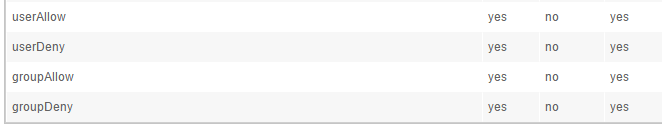
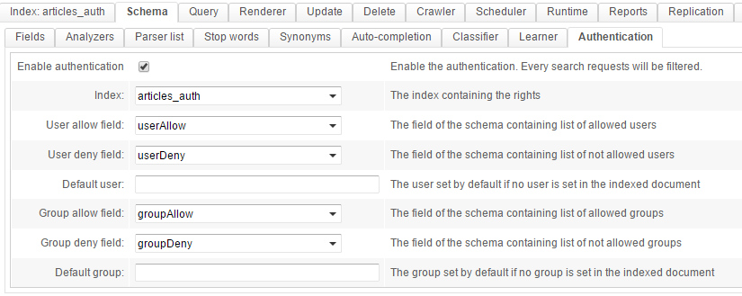
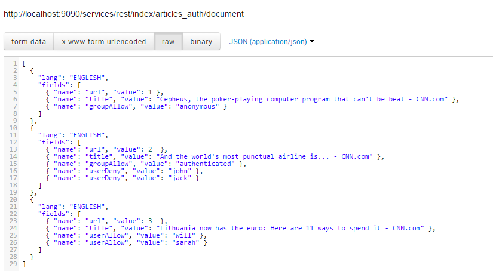
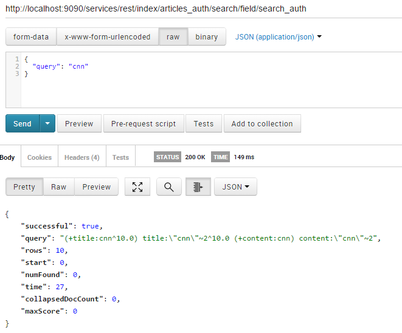
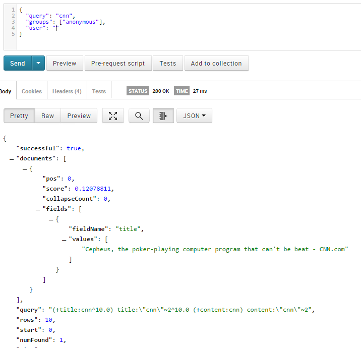
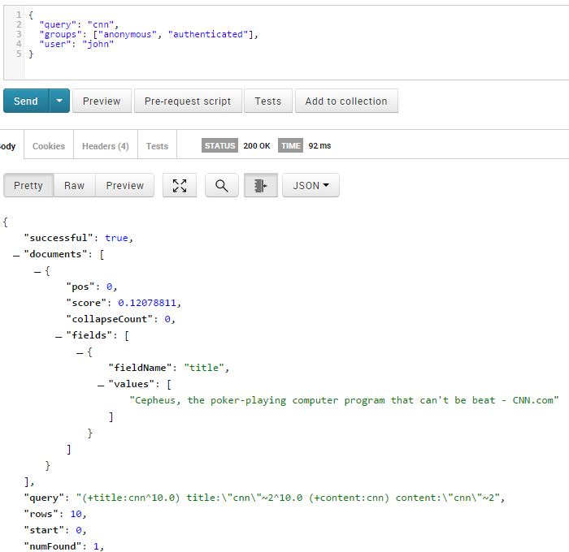
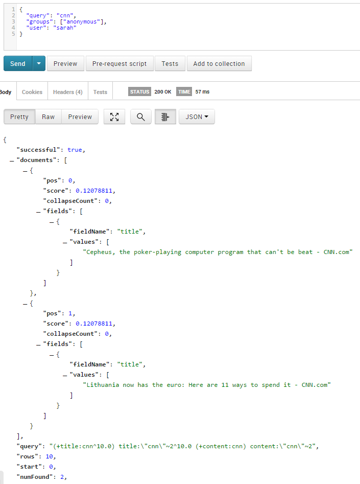
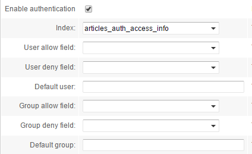
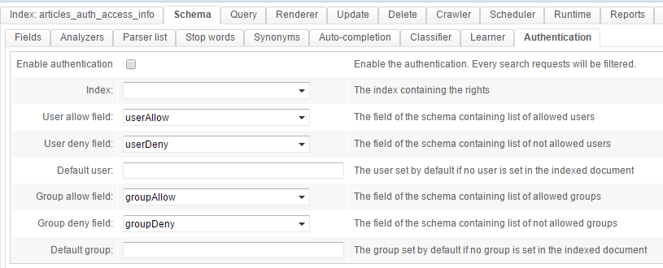
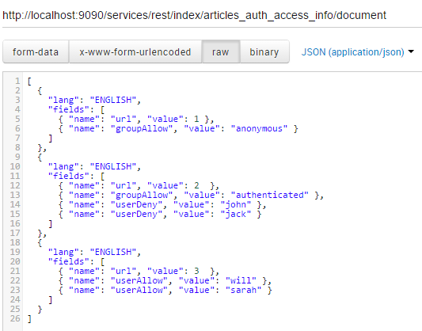

## How to configure advanced authentication

**This requires OpenSearchServer 1.5.10 or greater**

OpenSearchServer comes with a powerful authentication feature. It allows for returning different results for the same query depending on the users or groups making the query.

### How the authentication works

The access information related to each document must be indexed alongside the documents. This information must go into 4 specific fields:

* one will store a _white list_ of users (commonly called `userAllow`)
* one will store a _black list_ of users (commonly called `userDeny`)
* one will store a _white list_ of groups (commonly called `groupAllow`)
* the last one will store a _black list_ of groups (commonly called `groupDeny`)

When querying, you will need to **pass two additional parameters: `user` and `groups`**. OpenSearchServer will run the query as usual but will also **compare values from these parameters to the values indexed in the specific fields**.

* for a document, if one value for the `user` parameter is found in the _users black list_, **or** if one value of the `groups` parameter is found in the _groups black list_ then this result **will never be returned** for this query.
* for a document to be filtered out from the results set, there is no need to match both `userDeny` and `groupDeny`. As soon as one of the field matches one of the given parameters, the document is excluded from the results.
* on the other hand, if one value for the `user` parameter is found in the _users white list_, **or** if one value of the `groups` parameter is found in the _groups white list_ for a document then this result **will be returned**.

### Configuring the schema

4 fields must be added to the schema of the index:



Then, going to the `Schema / Authentication` tab, you will need to tell OpenSearchServer **which field should have which role**:



**Don't forget to check "Enable authentication"!** As soon as this checkbox gets unticked, authentication is deactivated.

### Querying the index

Assume an index with these 3 documents:



1. The first document is visible by the "anonymous" group
2. The second document is visible by the "authenticated" group, but the "john" and "jack" users are blacklisted. **Even if "john" or "jack" belongs to the "authenticated" group they will not see this document**.
3. The third document is **only visible by two users**: "will" and "sarah"

Let's run some test queries:

The simple search template used for this example will be explained in a bit. The "Postman" extension for Chrome is used.

* If a query is run without any parameters related to authentication, no results will be returned :


```json
{
  "query": "cnn"
}
```



* If the only given group is "anonymous", the result is the only document visible by this group.

```json
{
  "query": "cnn",
  "groups": ["anonymous"],
  "user": ""
}
```




* If the accessing groups are "anonymous" and "authenticated", but the user is "john" then "john" can not see the #2 document:

```json
{
  "query": "cnn",
  "groups": ["anonymous", "authenticated"],
  "user": "john"
}
```




* If the accessing group is "anonymous" and the user is "sarah", doc #1 and #3 are returned as expected:


```json
{
  "query": "cnn",
  "groups": ["anonymous"],
  "user": "sarah"
}
```




----

Here is the search template used in this example:

```json
{   
  "start":0,
  "rows":10,
  "lang":"ENGLISH",
  "operator":"AND",
  "emptyReturnsAll":true,
  "returnedFields":[  
	 "title"
  ],
  "searchFields":[  
	 {  
		"field":"title",
		"mode":"TERM_AND_PHRASE",
		"boost":10.0,
		"phraseBoost":10.0
	 },
	 {  
		"field":"content",
		"mode":"TERM_AND_PHRASE",
		"boost":1.0,
		"phraseBoost":1.0
	 }
  ]
}
```

## Using an external index to store authentication information

Storing authentication information with each document can make it difficult to maintain the index if there are frequent changes. Re-indexing the whole document would be necessary each time a right changes.

This issue can be easily solved **by using a dedicated index for storing authentication information**.

This index must have 5 fields : the 4 fields described above (`userAllow`,`userDeny`,`groupAllow`,`groupDeny`) plus a field used to join information with the index storing the documents. In our example, that field would be `url`.

Here is an example schema:

`GET` on `http://localhost:9090/services/rest/index/articles_auth_access_info/field`:

```json
{  
   "successful":true,
   "info":"5 field(s)",
   "fields":[  
      {  
         "name":"userAllow",
         "indexed":"YES",
         "stored":"NO",
         "termVector":"YES"
      },
      {  
         "name":"userDeny",
         "indexed":"YES",
         "stored":"NO",
         "termVector":"YES"
      },
      {  
         "name":"groupAllow",
         "indexed":"YES",
         "stored":"NO",
         "termVector":"YES"
      },
      {  
         "name":"groupDeny",
         "indexed":"YES",
         "stored":"NO",
         "termVector":"YES"
      },
      {  
         "name":"url",
         "indexed":"YES",
         "stored":"NO",
         "termVector":"NO"
      }
   ],
   "unique":"url",
   "default":"url"
}
```

The `url` field is marked as a **default** and **unique** field.

Then the `userAllow`,`userDeny`,`groupAllow` and `groupDeny` fields are deleted from the first index's `articles_auth` and its authentication settings are changed:



Authentication settings are configured in the second index's `article_auth_access_info`:



Finally, authentication information is indexed:



All done! Now when the rights for documents change **you will only need to update the dedicated index** without having to re-index all documents.
