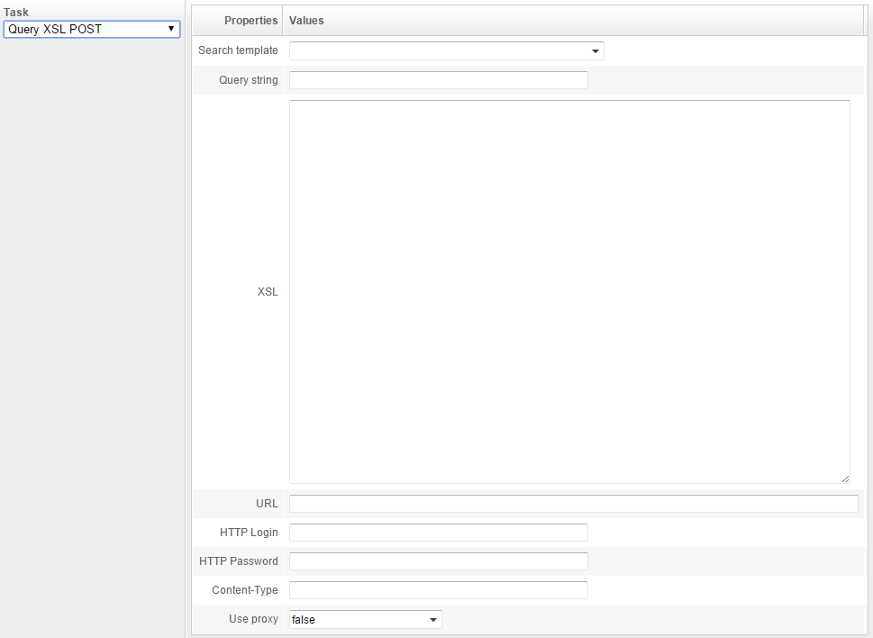
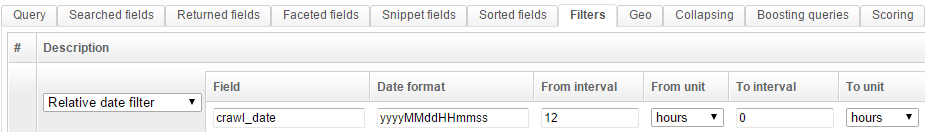
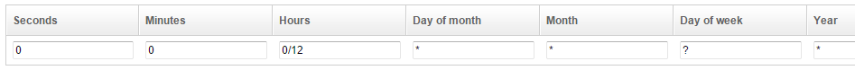

## How to export data to an URL

Starting with version 1.5.10, OpenSearchServer can easily export data by making a POST request to an URL.

### Task Query XSL POST

This export process can be configured by creating a job in the scheduler. Task `Query XSL POST` must be used.

This task performs 3 sub-tasks:

* it **makes a search request using an existing query template**,
* it then **applies an XSL transformation** to the results of the query,
* and finally it **`POST` the result** of this transformation to the configured URL. 

You could for example use this new feature to **periodically send lastly indexed data to a server** of yours.



Parameters are:

* **Search template**: choose an existing search template in the list. 
* **Query string**: you can choose to give a particular query string to the search template. If you do not provide any query string here and you choose option "Empty query string returns all documents" when creating your search template then every documents would be exported (unless the search template use some filters - see below).
* **XSL**: write here some XSLT code. You must use [XSLT Version 1.0](http://www.w3.org/TR/xslt).  **Results from the search requests are given as XML**, in the **standard XML format from the V1 API of OpenSearchServer**. You can easily see an example of this XML by running a query for your search template in tab "Query" and then clicking on button `XML/HTTP API call`. Here is an example of such an XML:

```xml
<?xml version="1.0" encoding="UTF-8"?>
<response>
<header>
<status>0</status><query>*:*</query>
</header>
<result name="response" numFound="5" collapsedDocCount="0" start="0" rows="10" maxScore="0" time="9">
	<doc score="3" pos="0" docId="2">
		<field name="id">5</field>
		<field name="author">Banner Bruce</field>
		<field name="category">Politics</field>
		<field name="date">2014-10-03 11:28:28.0</field>
		<field name="dateCrawl">1421062175</field>
		<snippet name="title">Curabitur tincidunt risus at efficitur		</snippet>
		<snippet name="content">Curabitur tincidunt risus at efficitur tempor. Suspendisse sed iaculis enim. Sed felis mauris, dapibus ut nisi a, consectetur consectetur erat. Morbi iaculis volutpat pharetra. Donec augue ex, gravida maximus ex a, mattis interdum urna. In hac habitasse platea dictumst. Curabitur tempor elementum efficitur. Cras sagittis convallis interdum. Nullam id lacus risus. ...Vivamus feugiat, mi eget mollis volutpat, nisi elit feugiat tortor.		</snippet>
	</doc>
	...
```

* **URL**: URL results from the XSL transformation should be send to, as a HTTP `POST` request. Result is send as the POST data.
* **HTTP Login** and **HTTP Password**: credentials to use for HTTP Basic Authentication, if any.
* **Content-Type**: content type to use for the HTTP request. For example: `text/csv`.
* **Use proxy**: whether proxy defined in tab Crawler / Web / Proxy should be used for making the HTTP request or no.

#### Creating a search template for periodical export

You may want to export data periodically, and thus only search for data indexed lastly, in the last 12 hours for example. To do so you should use a **Relative date filter** in your search template. See details in the section _"How can I dynamically filter on dates?"_ on our [How to use filters on a query](http://www.opensearchserver.com/documentation/faq/querying/how_to_use_filters_on_query.md) page.

Filter could be:



You can then configure your job of scheduler for running every 12 hours:

