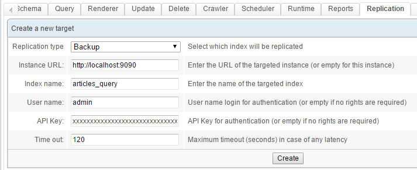
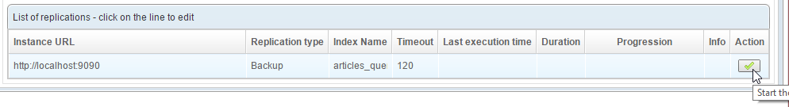
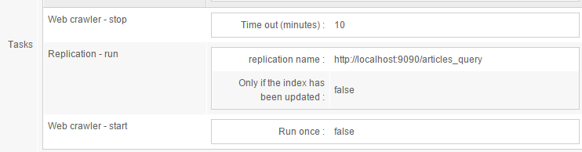
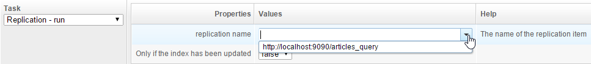
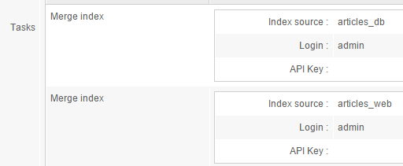
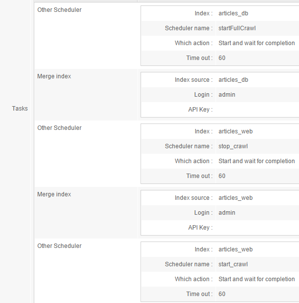
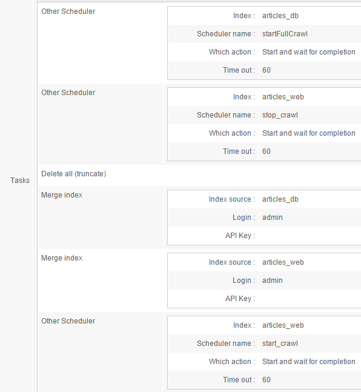

## How to replicate and merge indexes

OpenSearchServer can easily replicate an index to another location, either locally or on a remote OpenSearchServer instance. Several indexes can also be merged into one index. This article will explain all this.

### Replicating indexes

Different types of replication are available. Most of the time the replication feature will be used to fully copy an index, usually to serve as a backup. 

Another **common best practice** is to set up an index for data feeding (using APIs or Crawlers), and **a replication of this index for querying**.

To do so:

* **Start by creating the target index**. It should be an `Empty index`. For instance create an `articles_query` index, which will be a replication of the `Articles` index. This new index will be used solely for querying purposes.
  * This target index can be created on the same instance as the main index, or **it could be created on a remote instance of OpenSearchServer**. The only condition is that this instance must be reacheable through HTTP by the first one. 
* Go back to the main index and go to the `Replication` tab. Create a `Target` as shown below:

  * Take care to choose "Backup" as the `Replication type`.
* Click the `Create` button. This new replication target is added to the list displayed below. To start the replication simply click on the button with the green icon.

  * **Take care**: ongoing crawlers should be **stopped** before starting a replication. Otherwise, the targeted index might get corrupted after replicating.

#### Scheduling a replication

A replication can be scheduled with a job in the Scheduler (in the `Scheduler` tab). For instance create a task as follows:

This task stops the web crawler, then proceeds with the replication, then restarts the web crawler.

When working with the `Replication - run` task, to find the name of the replication, press the "Down arrow" key on your keyboard -- or click the button on the right of the field. This will display an autocompleted list of available replications.

Always leave the `Only if the index has been updated` field set to `false`. Replication is incremental anyway.

### Merging indexes

Several local indexes can be merged into a single index.

One example of use is when setting up multiple indexes that use different types of crawlers. For instance, you may want to dedicate one index to database crawling, and one other index to web crawling. Or you may want to distribute the crawling of several websites across multiple indexes.

However when data is split across indexes it can not be searched in one swoop. This is where the merging feature comes in handy.

By setting up a single, merged index **you will be able to search through all your data**.

The relevant indexes must have some common fields. The best practice when working with the merging feature to **use the same schema for all these indexes**, when possible.

#### Creating the merging task

To merge two indexes, simply create a job for the `Scheduler` in the final index, using the `Merge index` task.

For instance, to merge the `articles_db` and `articles_web` indexes into a third index named `articles_query` you could use these tasks:

#### Controlling the web crawler's status

As previously noted, when merging indexes one must ensure that their data is not currently being modified. It is thus a **strongly recommended practice to stop the crawlers** (Web crawler and File crawler) for these indexes. 

Doing this is easy, since the `Scheduler` **can start tasks in other indexes**.

The above task thus becomes:
 

In this example, when the `Scheduler` launches work on the `articles_query` index it also issues orders about the `articles_web` index (for our purposes, these would use the `Web crawler - stop` and `Web crawler - start` Scheduler tasks).

The same can be done with an index that might be running a file crawler. However...

#### Handling the database crawler

However, the database crawler cannot be stopped or started in the same way.

An alternative is to use the Scheduler to also launch the database crawling process for the `articles_query` index.

Here is an example of this:

So we added, as a first task, an `Other scheduler` task that starts a full database crawl in the `articles_db` index. The `startfullCrawl` job would use a `Database crawler - run` task.

#### Deleting content before merging

Merging is a low-level process that does not worry about the unique keys used to identify documents. Thus, multiple mergings of a given index could lead to duplicated content.

Since the final merged index is often reserved for querying and will only ever be modified by merges, we could simply **delete its entire content** before merging. This is a common practice.

Here is an example of such:

What it does is:

1. A full database crawl is launched on `articles_db`
2. The web crawler is stopped on `articles_web`
3. All content is deleted from `articles_query`
4. The content is merged from `articles_db` into `articles_query`
5. The content is merged from `articles_web` into `articles_query`
6. The web crawler is started on `articles_web`

#### Going further

When executing the above process, there will a a short while during which the index will be empty. 

To avoid this, you could **use the `articles_query` index as an intermediate index**, and add a final replication to another index at the end of the merging job.

For example, replicating a full backup to `articles_final_query` after the final `start_crawl` task would allow for **smooth merging with no side effects for your users**.
