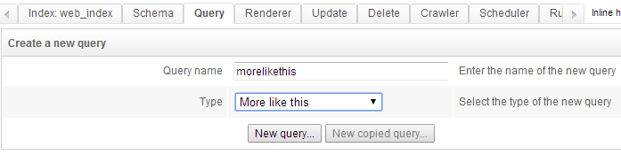
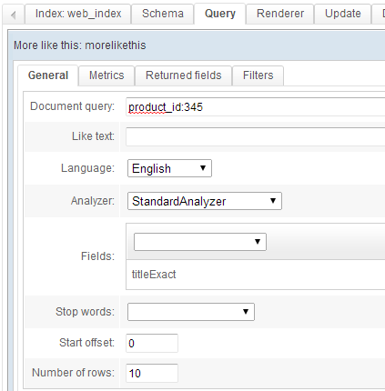
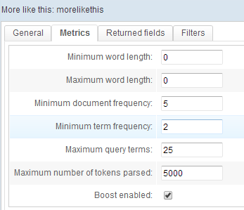
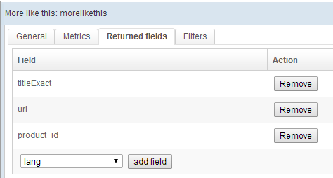
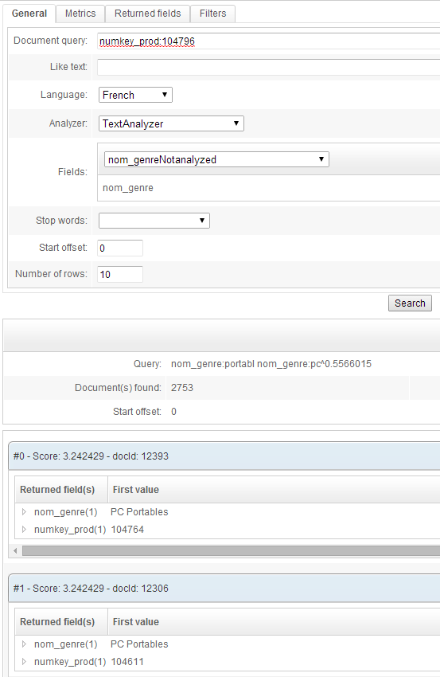

## How to use More Like This feature

We will explain here how MoreLikeThis queries can be created in order to find documents similar to one specific document.

This feature can be really useful in lots of case, in particular when working on e-commerce or news websites where pages often shows "similar" products or articles at the end.

First, start by creating a new Query in tab Query. Choose type "More like this".

Since this query is built to return documents similar to another let's write some query to identify this particular document in field `Document query`, for example `product_id:345` if our schema has a field named `product_id`. This query must be written in the usual query pattern format.

Field `Like text` must be left empty.

Select language of your documents in list `Language`.

Some fields must then be added in area named `Fields`. Those fields will be the ones used to find similarity between documents. In list `Analyzer` the same Analyzer that the one used in index'schema for the chosen fields must be selected.

`

Second tab allow configuration of some metrics. Default values are fine to start with.

At last some returned fields must be configured:

Here is an other example where products are identified by a field name `numkey_prod`. Similarity is computed from field `nom_genre`, which is products'categories.

Of course this query template can be used in an API call, where "Document query" can be easily overiden. Have a look at the [More Like This API section of our documentation](http://www.opensearchserver.com/documentation/api_v2/more-like-this/README.html).
