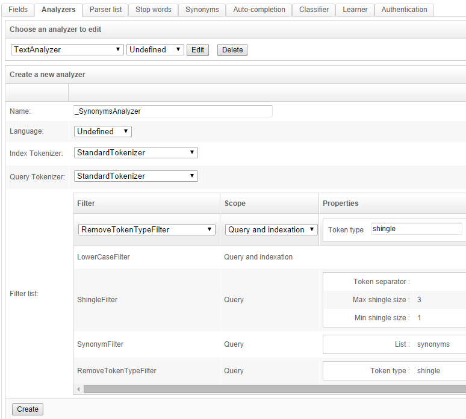
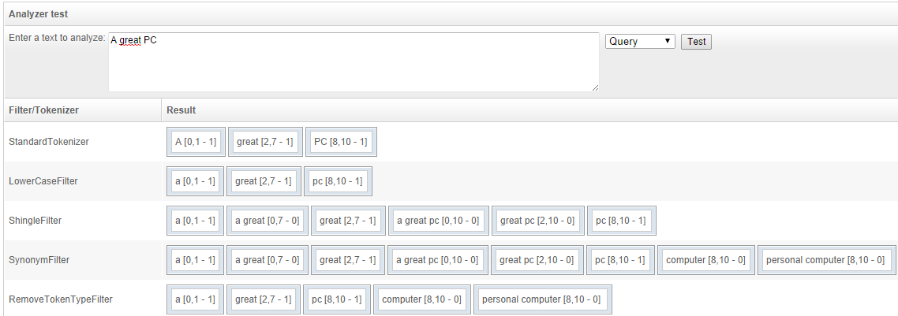
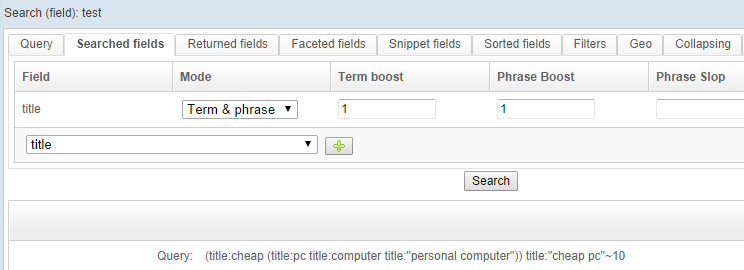

## How to use synonyms

OpenSearchServer provides some great features when working with synonyms:

* OpenSearchServer is able to handle several lists of synonyms. 
* Synonyms can be expressions made of several words. 
* There is no limit to the number of synonyms for one term.
* **Synonyms are used at query time only**, allowing easy management of lists of synonyms!

In OpenSearchServer, lists of synonyms are easily created under tab `Schema` / `Synonyms` by simply writing synonyms terms on one line, for instance:

```
pc,computer,personal computer
joystick,gamepad
```

### Configuring schema to work with synonyms

Index's schema must be configured to make use of these lists of synonyms. `Analyzers` are involved here. Indeed, some filters need to be added to a new or to an existing analyzer, like in this example:



Here are the tokens created by this analyzer when search query is "a great pc":



Steps are:

1. Tokenizer splits sentence in tokens.
2. Filter `LowerCaseFilter` transforms every word to lower case.
3. Filter `Shingler filter` creates several group of tokens, from 1 to 3 words, since it has been configured this way (see `Max shingle size` and `Min shingle size` in above screenshot). Here `Max shingle size` must match the number of words in the biggest synonym of the list. Since in our previous example the biggest synonym is "personal computer" a `Max shingle size` of 2 would have been enough here.
4. Filter `SynonymFilter` detect available synonyms by comparing each token to the list of synonyms and add them to the list of tokens.
5. Filter `RemoveTokenTypeFilter` removes every "shingles" previously created.

The last 3 filters are only applied at query time. This allows lots of flexibility: documents can be indexed first and list of synonyms can be enhanced later without having to index again data.

### Configuring queries to make use of synonyms

Query must be of type `Search (field)`. Searched fields **must use mode `Term & Phrase`** for correct handling of synonyms. Here is an example of a search for text "cheap pc" on a field `title` using the above analyzer:



Final query pattern used by OpenSearchServer is `(title:cheap (title:pc title:computer title:"personal computer")) title:"cheap pc"~10`. This is extremely powerful because it actually acts like if several queries were made. Indeed, the automatic use of boolean `OR` in this pattern means: search for `cheap pc` OR `cheap computer` OR `cheap personal computer` OR `"cheap pc"`. This way, a document which would have been indexed with title "A cheap computer" could be found when searching for "cheap pc".