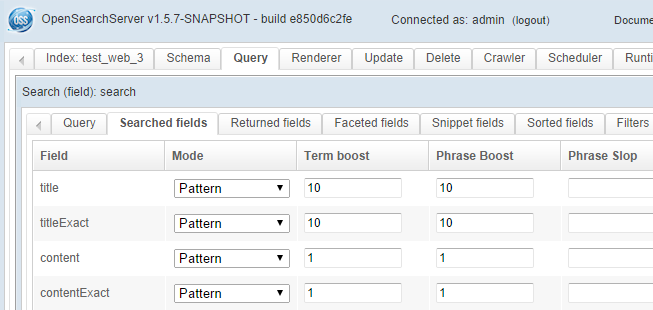
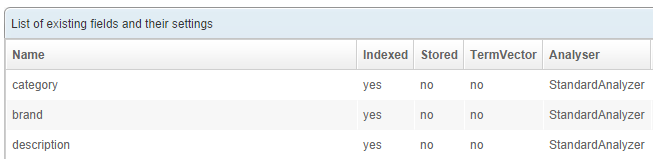
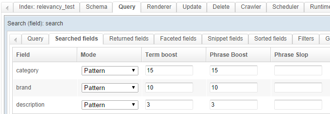
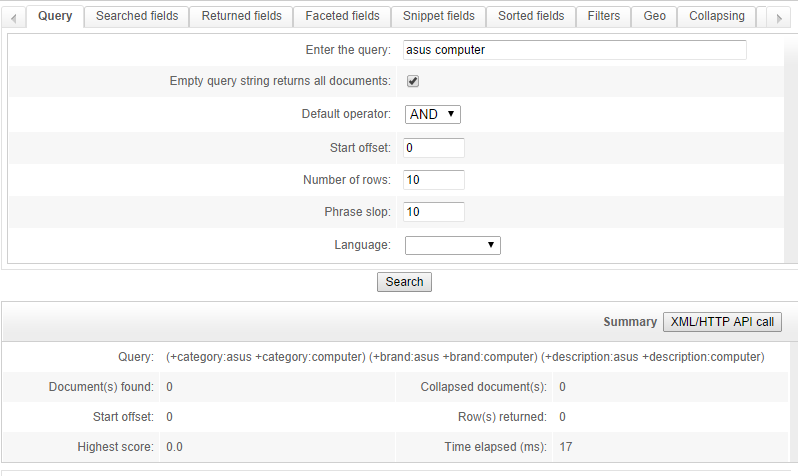
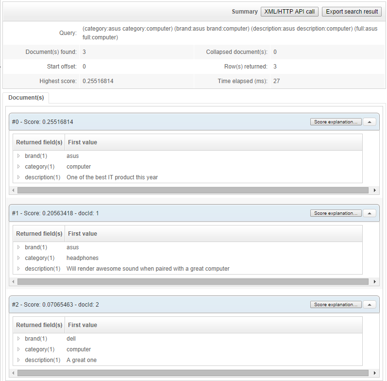
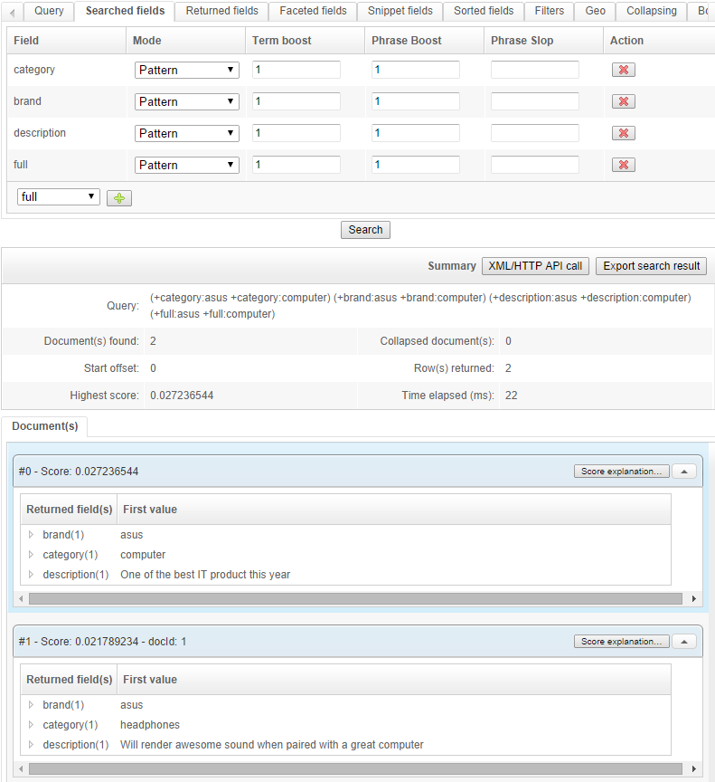
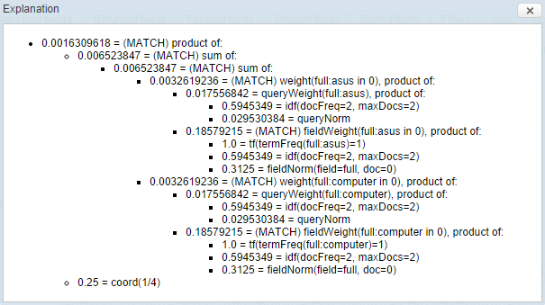
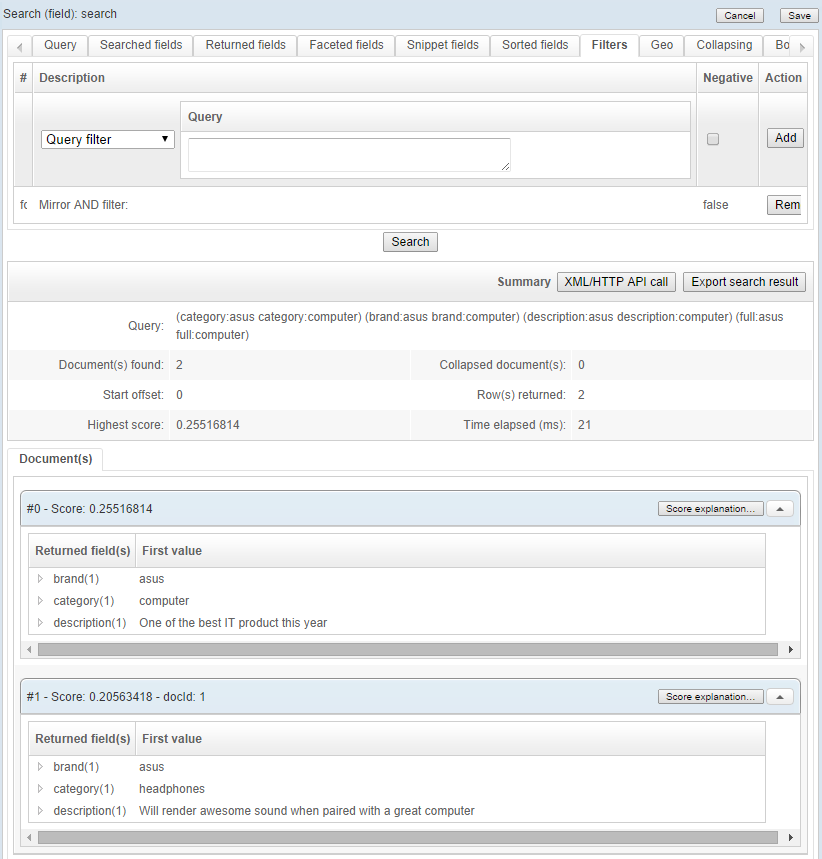
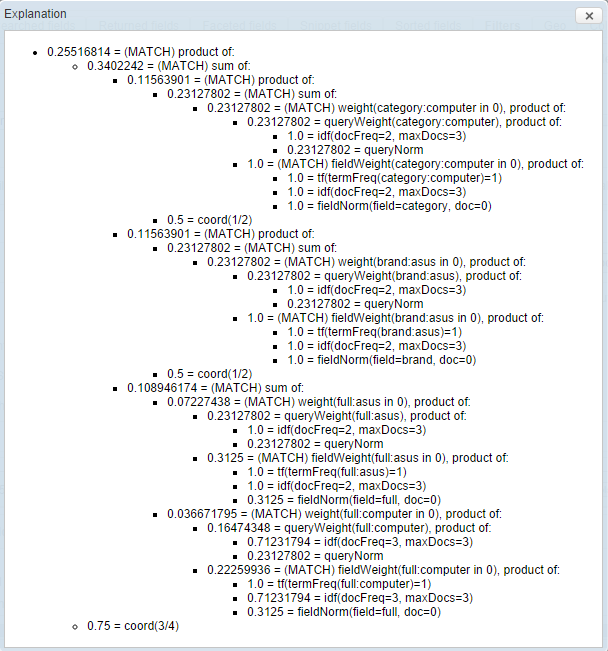

## Improving relevancy with "Miror AND filter"

When a search query is made, OpenSearchServer finds **documents matching this query** and then **compute a score for each document**. This score shows how closely a document match the query.
For a document to match the query, some of its fields must contain searched keywords. Fields in which search will occur are the ones configured in the query (for example in tab `Searched fields` for a query of type `Search (field)`).

This is where `Search operator` becomes important. When using a boolean `OR`, OpenSearchServer will keep a document in results set as soon as only one of searched keywords is found in one the searched fields. However, when using an `AND`, every keywords must be found in one of the searched fields for the document to be kept. This is a powerful feature and it will suit most of the needs: some people will prefer to work with an `OR` for some reasons, while others will use an `AND`.

This process can, however, show its limitation in some complex case. 

Let's take an example:

* Index's schema has several fields: `category`, `brand`, `description`
* Several documents are indexed with these values:
  * Doc #1: `category` is "**computer**", `brand` is "**asus**" and `description` is "One of the best IT product this year".
  * Doc #2: `category` is "headphones", `brand` is "**asus**" and `description` is "Will render awesome sound when paired with a great **computer**".
  * Doc #3: `category` is "**computer**", `brand` is "dell" and `description` is "A great one".
  
_Screenshot of schema:_

_Screenshot of documents:_

A first problem comes to mind here: when searching for "asus computer", if one wants to use operator `AND` (in order to restrict results to documents having both words), no result will be returned, since **there is no field containing both words**. 

_Screenshot of searched fields:_

_Result when searching for "asus computer":_

If operator `OR` is used then **every field having at least one searched keyword is used for computing score**, but a document with only word "computer" is returned, even if it does not contain "asus", which is not what we want here.

_When searching with an `OR`:_

Common solution to this is to **create a field called `full`** and to **copy every text values** into it:

After re-indexing data and adding field `full` in list of searched fields we can see that 2 documents are returned:

We can see however that **both documents have poor scores**. In spite of the huge boost given to fields `category` and `brand` first document does not seem to stand out from the other one.

This is because **fields `category` and `brand` have not been used in scoring there**. Indeed, those fields do not have both searched keywords, thus OpenSearchServer only used field `full` to score documents.

_Screenshot of popup explaining score (button "Score explanation"):_

To bypass this limitation a new feature has been implemented in OpenSearchServer (from build 1.5-b731). 

It is now possible to **compute score for documents based on an operator `OR`** but still **filter results like an `AND`** operator would do.

In our example, if **an operator `OR` is used** instead of an `AND` **and a filter `Miror AND filter`** is added, results will be:

Only 2 documents are returned (the ones having both searched words), and now scores are higher and show a bigger difference! Indeed, fields `category` and `brand` were used and boosted as configured.

_Explanation of score for first result:_

