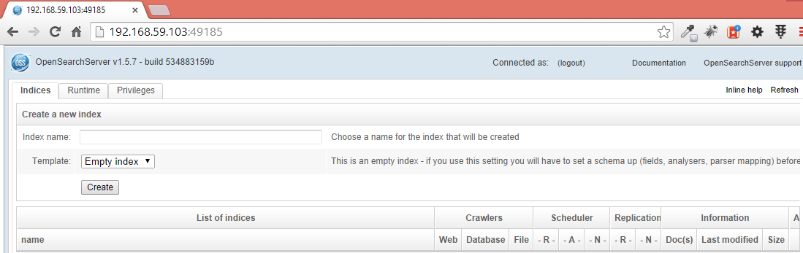
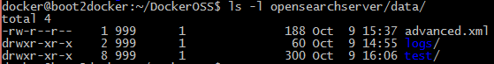
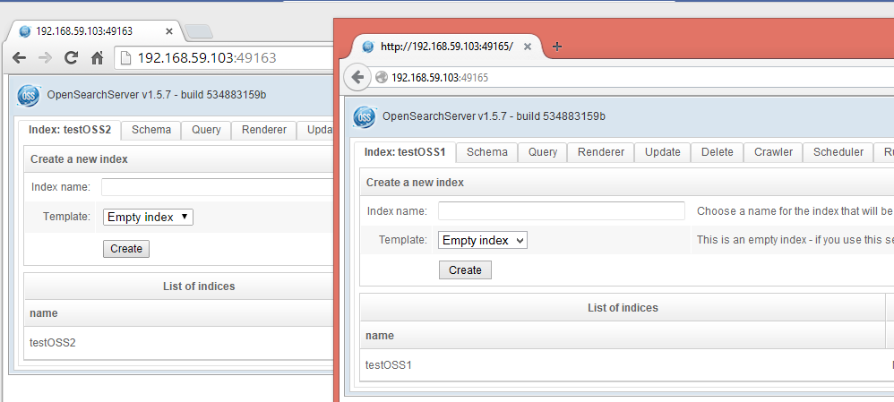

# Docker image for OpenSearchServer

Using this image allows for the quick creation of any number of parallel systems hosting OpenSearchServer. 

## Usage

### Run a container

In the command line below, `/path/to/local/folder` must be a directory, which must contain a directory named `opensearchserver/data`. **This is the directory that will be used by OpenSearchServer as its data folder**.

    docker run -d -P -v </path/to/local/folder>:/srv alexandretoyer/opensearchserver

* parameter `-d` tells Docker to daemonize this container (so it runs in the background)
* parameter `-P` tells Docker to map those ports exposed in the container
* parameter `-v` is used to map a local folder to the `/srv` folder within the container

#### Configure the memory allocation

To determine how much memory OpenSearchServer can access, you can set the variable called `MEMORY`.

Its value can be expressed using these three units - `k`, `m` or `g`. For instance:

    docker run -d -P -v </path/to/local/folder>:/srv -e MEMORY=4g alexandretoyer/opensearchserver

### Determine the port used by Docker

    docker ps -l

Here is a typical output for this command:

    CONTAINER ID        IMAGE                                    COMMAND                CREATED             STATUS              PORTS                     NAMES
    3b49cb1c7fed        alexandretoyer/opensearchserver:latest   /bin/sh -c '/start_o   23 minutes ago      Up 23 minutes       0.0.0.0:49185->9090/tcp   backstabbing_mayer

The value in the `PORTS` column is the port to use. In this example it is port `49185`.

#### Using a particular port

Instead of using option `-P` one can use option `-p` with the additional parameters `<public port>:<exposed port>`. For example: 

    docker run -d -p 9091:9090 -v </path/to/local/folder>:/srv -e MEMORY=4g alexandretoyer/opensearchserver

This would allow OpenSearchServer to be accessed through port 9091.

### Give a specific name to the container

A name can be given to the container by using the `--name` option. For example:

    docker run --name oss -d -P -v </path/to/local/folder>:/srv -e MEMORY=4g alexandretoyer/opensearchserver

### Open a browser to access OpenSearchServer

Browse to `127.0.0.1:<port used by Docker>`. In the above example that would be: `127.0.0.1:49185`.

OpenSearchServer now runs within a Docker container:

The data folder is stored on the host system. For instance, after having created an index named `test`:

#### When using Boot2docker

Start by using the command `boot2docker ip` to know which IP address is used by Boot2docker. Then use this IP address and the port used by Docker to access OpenSearchServer. For example - `192.168.59.103:49185`.

### Managing OpenSearchServer within a running container

It may be useful to manage an OpenSearchServer instance that is embedded within a running container.

To do so use [jpetazzo/nsenter program](https://github.com/jpetazzo/nsenter).

In this example (which uses _Boot2docker_ on a Windows system), a container gets created and is then accessed to stop and restart OpenSearchServer:

    docker@boot2docker:~/DockerOSS$ docker run -P -d -v ~/DockerOSS/OSS1:/srv alexandretoyer/opensearchserver
    3e9442f18a6abe12513e12ddd8206f1c2e3008912039202b0bd631f4923b78c0
    
    docker@boot2docker:~/DockerOSS$ docker ps
    CONTAINER ID        IMAGE                                    COMMAND                CREATED             STATUS              PORTS                     NAMES
    3e9442f18a6a        alexandretoyer/opensearchserver:latest   /bin/sh -c '/start_o   3 seconds ago       Up 2 seconds        0.0.0.0:49153->9090/tcp   trusting_almeida
    
    docker@boot2docker:~/DockerOSS$ /var/lib/boot2docker/docker-enter trusting_almeida
       root@3e9442f18a6a:~# service opensearchserver stop
       Stopping OpenSearchServer ...
       OpenSearchServer stopped ...
    
       root@3e9442f18a6a:~# service opensearchserver start
       Starting OpenSearchServer ...
       OpenSearchServer started ...
    
       root@3e9442f18a6a:~# exit
       logout
    
    docker@boot2docker:~/DockerOSS$ 

## Creating several containers
It is now possible to create multiple containers:

    mkdir -p OSS1/opensearchserver/data
    mkdir -p OSS2/opensearchserver/data
    docker run -d -P -v ~/DockerOSS/OSS1:/srv -e MEMORY=3g alexandretoyer/opensearchserver
    docker run -d -P -v ~/DockerOSS/OSS2:/srv -e MEMORY=1856m alexandretoyer/opensearchserver

Here running `docker ps` will result in:

    CONTAINER ID        IMAGE                                    COMMAND                CREATED             STATUS              PORTS                     NAMES
    2f95109b18c8        alexandretoyer/opensearchserver:latest   /bin/sh -c '/start_o   3 minutes ago       Up 3 minutes        0.0.0.0:49165->9090/tcp   backstabbing_morse
    b98be11e2d33        alexandretoyer/opensearchserver:latest   /bin/sh -c '/start_o   5 minutes ago       Up 5 minutes        0.0.0.0:49163->9090/tcp   trusting_kowalevski

These instances can be accessed by two separate browsers, and two different indexes can be created:

Indexes are created within two different folders, like this:

    docker@boot2docker:~$ ls -l DockerOSS/OSS1/opensearchserver/data/
    total 4
    -rw-r--r--    1 999      1              188 Oct 10 08:11 advanced.xml
    drwxr-xr-x    2 999      1               60 Oct 10 08:04 logs/
    drwxr-xr-x    7 999      1              200 Oct 10 08:12 testOSS1/
    docker@boot2docker:~$ ls -l DockerOSS/OSS2/opensearchserver/data/
    total 4
    -rw-r--r--    1 999      1              188 Oct 10 08:10 advanced.xml
    drwxr-xr-x    2 999      1               60 Oct 10 08:09 logs/
    drwxr-xr-x    7 999      1              200 Oct 10 08:12 testOSS2/
    docker@boot2docker:~$

---

## FAQ

#### When trying to create an index I get the following error: `Exception inconnue: java.lang.NullPointerException.`
* Try running the container with more memory (for example `-e MEMORY=2g`).
* Check that the `opensearchserver/data` directory (mapped to `/srv`) has sufficient access rights.

#### When accessing OpenSearchServer's interface I see a red message saying `There is an issue with the data directory. Please check that the OPENSEARCHSERVER_DATA environment variable points to a valid directory.`
* Check that this container is running using a correct mapping between a local folder and `/srv`. This local folder must contain a directory named `opensearchserver` and this `opensearchserver` directory must contain a directory named `data`.
* Check that the `opensearchserver/data` directory has sufficient access rights.

---

## Build images
### Clone repo

    git clone https://github.com/AlexandreToyer/opensearchserver-docker.git

### Build images

#### Image for Debian + OpenJDK

    docker build -t="alexandretoyer/debian-openjdk7jdk" ./debian-openjdk7jdk/

#### Image for OpenSearchServer

Current Dockerfile will download and use **`opensearchserver-1.5.9-b868.deb`**.

    docker build -t="alexandretoyer/opensearchserver" ./opensearchserver/
