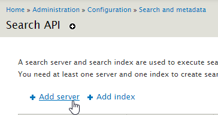
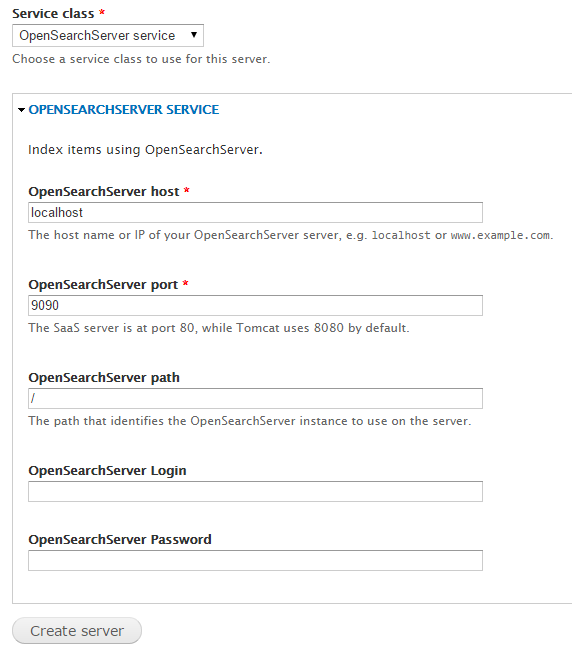
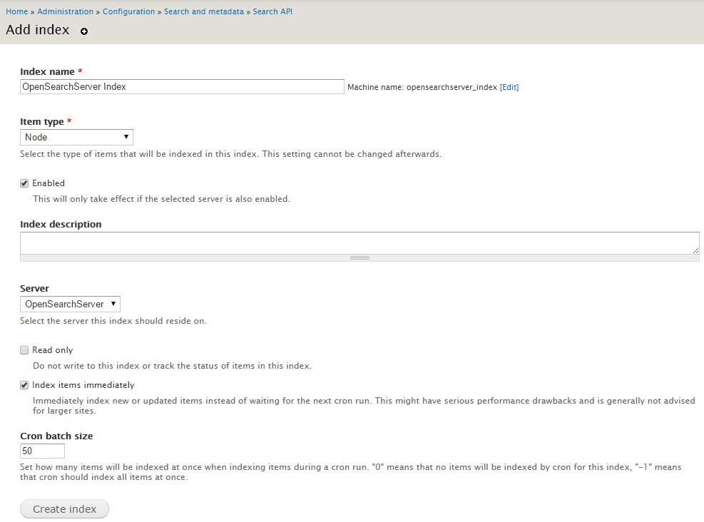
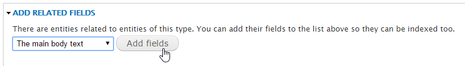
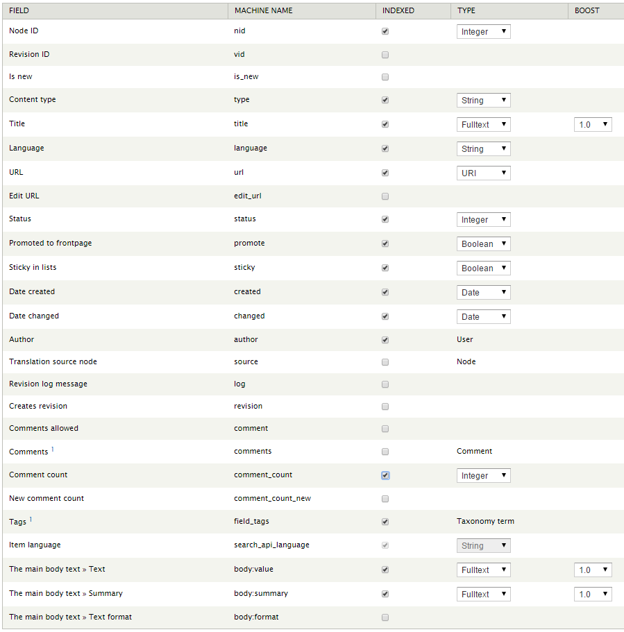

## Configuring the OpenSearchServer module for Drupal 7

Further details about configuring Drupal's Search API can be found on the [Search API's documentation pages](https://www.drupal.org/node/1251246).

Search API uses 2 main entities: **server** and **index**. We will thus configure a new **server** that will be our running OpenSearchServer instance, and a new **index** that will use this server.

### Creating a server

Go to the _/admin/config/search/search\_api_ page and click "Add server". 

Fill in the form:

* Server name: **OpenSearchServer**
* Enabled: **checked**
* Service class: choose **OpenSearchServer service**
  * OpenSearchServer host: _URL for your OpenSearchServer instance_. Example: **localhost**.
  * OpenSearchServer port: _port to use_. Example: **9090**.
  * OpenSearchServer path: _path that identifies the OpenSearchServer instance to use on the server_. Example: **/**.
  * OpenSearchServer Login: _login of a user with read and write access_. Example: **admin**.
  * OpenSearchServer Password: _API key for this login_.

Click "Create server".

  
### Adding an index

Go to the _/admin/config/search/search\_api_ page and click "Add index". 

Fill in the form:

* Index name: **OpenSearchServer Index**
* Item type: **Node**
* Enabled: **checked**
* Server: **OpenSearchServer**
* Index items immediately: you may want to check this for development purposes if your website contains but a few documents. It will simplify testing.
* Cron batch size: leave the default value of **50** for now. It can be changed later.

  
Click "Create index".

---

If error _Fatal error: Class 'OssApi' not found in ...\drupal-7.33_2\sites\all\modules\drupalplugin_oss\service.inc on line 242_ is shown: please check that you followed the steps in the **Installing OpenSearchServer's PHP library** in [the Installing page](installing.md) section.

---

#### Configuring fields

The next page allows for choosing what fields should be indexed.

In "Add Related Fields" at the bottom of the page, choose "The main body text" and click "Add fields".

You could start by selecting these fields, they can be changed later:

  

Click "Save changes".

On the next page, do not check any _Data Alteration_ or any _Processor_ option for now and click "Save configuration".

#### Enabling facets

Go to the newly created index main page (_/admin/config/search/search\_api/index/opensearchserver\_index_) and click on the "Facets" tan.

For the purposes of this tutorial, check "Content type" and "Author" then click "Save configuration".

---

Let's now see [how search pages can be created](searching.md).
