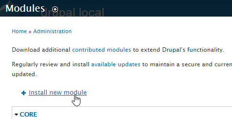
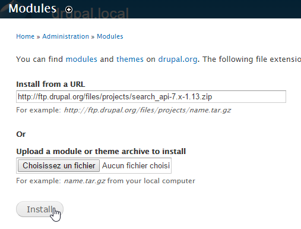
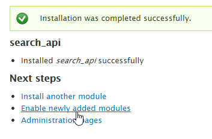
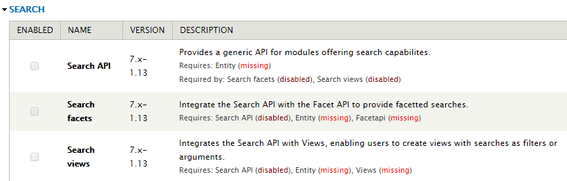
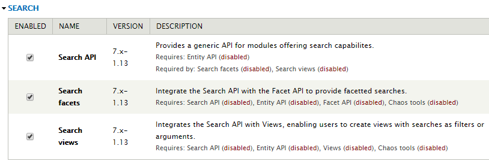
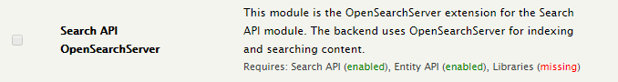
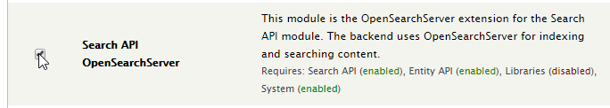
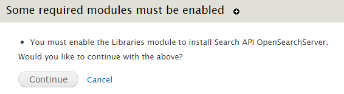

## Installing the OpenSearchServer module for Drupal 7

### Requirements

In addition to the required modules detailed below, you will need a running instance of OpenSearchServer. We recommend using our [SaaS hosting solution](http://www.opensearchserver.com/#saas) for the latter.

### Installing dependencies

The main required module for the OpenSearchServer module is **Search API**. However, Search API has its own requirements. Thus the full prerequisites are :

* Search API
* Entity
* Facet API
* Libraries

You'll probbaly also want to install and enable the following modules to create search pages:

* Views
* CTools
 
#### Full installation process

Assuming a fresh new Drupal website, follow these steps:

##### Installing Search API

We suggest using the built-in installation feature. In _/admin/modules_, click on "Install new module".

Copy/past the link for a `.tar.gz` or a `.zip` packaging of the Search API module.

Click "Install", and then click on "Enable newly added modules". This will take you back to the Modules page.

##### Installing the required modules for Search API

You can now see that Search API, Search facets and Search views also have dependencies. We shall install them all!

Repeating the above process, install the **Entity**, **Views** and **Facetapi** modules.

The dependencies for these are now displayed. Which means you have to install the **CTools** module as well.

##### Enabling modules

Check the boxes for the **Search API**, **Search facets** and **Search views** modules, then click on "Save configuration". 
 

On the next page, click on the "Continue" button to also enable the required modules.

### Installing the OpenSearchServer module

Download the module (_-- download link will be added soon --_) and upload it to `/sites/all/modules`. Then go to the _/admin/modules_ page.

The OpenSearchServer module requires the **Libraries** module. Repeating those steps explained above, install **Libraries**.

 
#### Enabling OpenSearchServer

Check the box for the "Search API OpenSearchServer" module then click on "Save configuration". 

On the next page, click on the "Continue" button.
 

 
### Installing OpenSearchServer's PHP library

Download version 1 of OpenSearchServer's PHP library there -  [https://github.com/jaeksoft/opensearchserver-php-client/archive/1.x.zip](https://github.com/jaeksoft/opensearchserver-php-client/archive/1.x.zip).

Unzip it to `/sites/all/libraries` and rename the folder from `opensearchserver-php-client-1.x` to `opensearchserver`.

**Duly note that** the destination folder is **`/sites/all/libraries`**, not `/sites/all/modules/libraries`.

---

Installation is over! It's time for [some configuration](configuring.md).
