## Searching using the OpenSearchServer module for Drupal 7

### Disabling the core Search module

The OpenSearchServer module for Drupal 7 cannot supersede the Core Search Drupal module on its own. You first have to disable the Core Search Module.

Go to the _/admin/modules_ page and uncheck "Search", then click on "Save configuration".

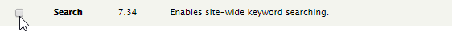

### Adding some test content

Since a fresh install is used in this tutorial, we will create some test "Articles" and "Basic pages":

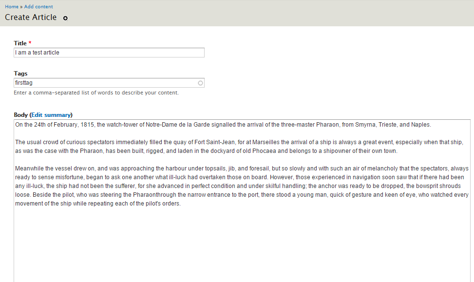

All content:

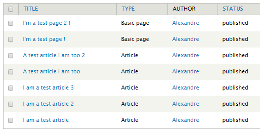

### Creating a search page using Views

Check that you enabled **Search views** in _/admin/modules_:

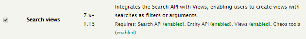

And enable the **Views UI** module:

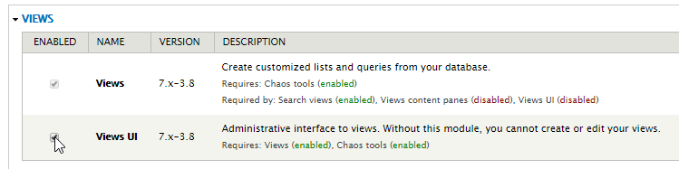

#### Adding a View

Go to the _/admin/structure/views/add_ page and fill in the form:

* View name: **Search**.
* Show: choose **OpenSearchServer Index** in the list (that's the name of the index we previously created), sort by **Unsorted**.
* Create page : **checked**
  * Page title: **Search**
  * Path : **search** 
  * Display format: **Unformatted list** option of **Rendered entity**
  * Items to display: **10**
  * Use a pager: **checked**

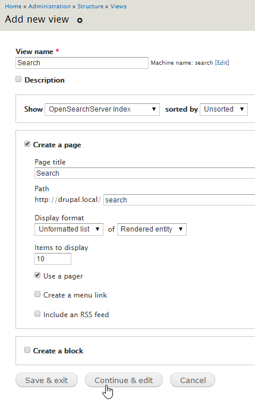

Click on "Continue & edit".

In the new form:

* Filter Criteria: click "Add" and check "Search: Fulltext search". Click "Apply (all displays)"
  * Expose this filter to visitors, to allow them to change it: **checked**
  * Label: **Search**
  * Value / Remember the last selection: **checked**
    * User roles: **anonymous user**, **authenticated user**
  * Use as: **Search keys**

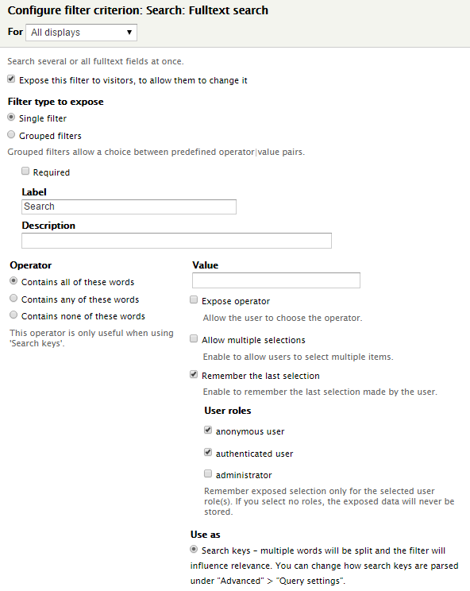 

* Sort Criteria: click "Add" and check "Search: Relevance".
* Page settings / Access: click "None" and choose "Permission" / "View published content".
* Advanced / Exposed form:
  * Exposed form in block: click "No" and choose "Yes"
  * Exposed form style: click "settings":
    * "Submit button text": write "Search"
    * Expose sort order: **unchecked**

Full configuration:

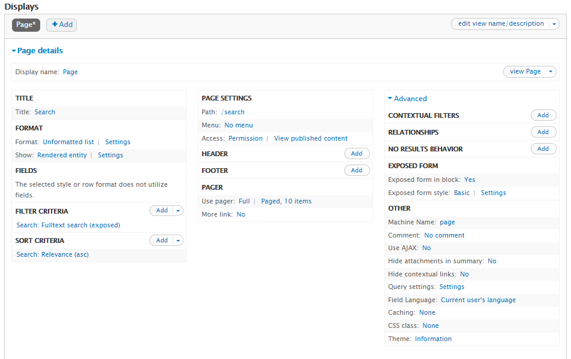 

#### Configuring the search block

Go to the _/admin/structure/block_ page and move the new block "Exposed from: search-page" to one region, for instance "Sidebar first".

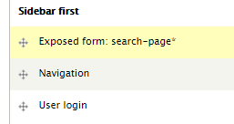 

Click "Save blocks".

#### Testing the page

Go to the _/search_ page. In the search block write some keywords, for instance "I'm a test page" and either press enter or click "Search".

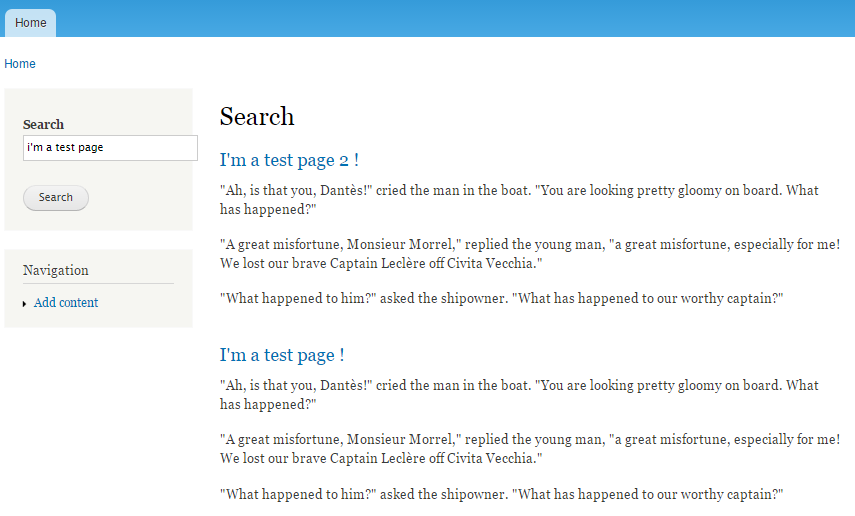

#### Editing the displayed fields

Displayed fields for each result can be changed. Go to the edit page for the View, _/admin/structure/views/view/search_.

In Format / Show click on "Rendered entity" and choose "Fields" instead. Click "Apply (all displays)" twice to close the window.

In "Fields", click on "Add". 

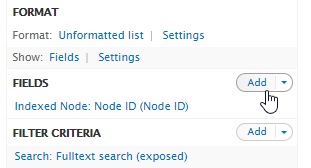

Then choose which fields to display, and configure them (add/remove labels, choose a format, etc.).

For example (see below for how to add facets):

All the chosen fields:

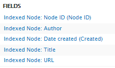

Click on "Save" and run a new search within this View:

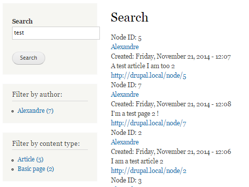

##### Highlighting found terms

To highlight found terms go to the Search API administration page, choose your index and click on the "Filters" tab (_/admin/config/search/search_api/index/opensearchserver_index/workflow_).

Check Processors / **Highlighting**.

Click on "Save configuration", go to the search page and run a new search:

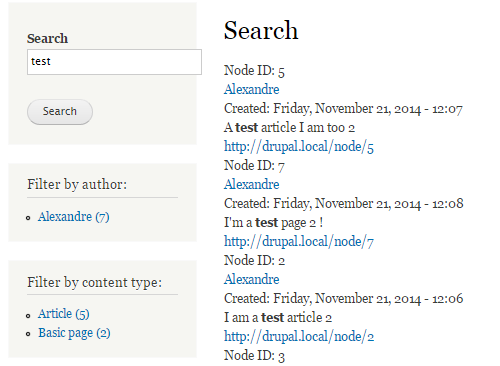

##### Adding an excerpt

Once the "Higlighting" processor is enabled: go to the edit page for the View and add the "Search: Excerpt" field.

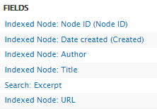

Save the view and run a new search: 

  
### Configuring facets

If you followed the "Enabling facets" step from the [Configuring](configuring.md) page, go to the following page: _/admin/structure/block_ 

Move the "Facet API: Search service: OpenSearchServer Index : Author" and "Facet API: Search service: OpenSearchServer Index : Content type" blocks to one region, for instance "Sidebar first". 

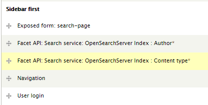

Click "Save blocks".

Reload the _/search_ page and run a query:

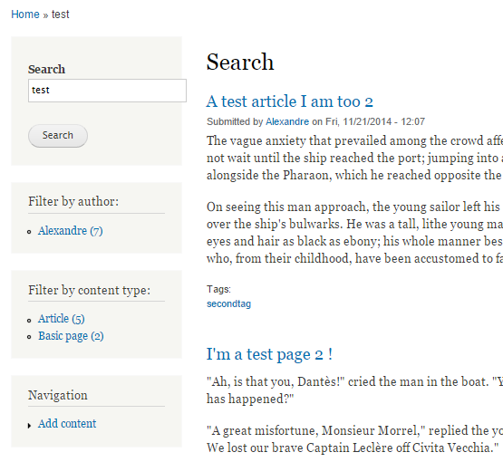
