## Crawling a database

This quick OpenSearchServer tutorial will teach you:
* how to crawl a MySQL database
* how to set up an attractive search page (with facets, auto-completion, snippets, etc.).

Here is an example of the end result:


## Creating the database

This example will use a small database with 3 tables. This database is used to store articles, authors and categories.

Here are screenshot of these tables:

**Table articles:**

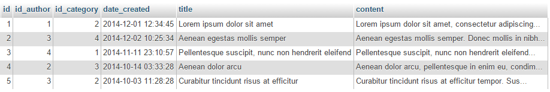

**Table authors:**

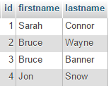

**Table categories:**

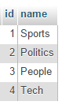

A query to retrieve all useful information might be:

```sql
SELECT a.id, a.title, a.content, a.date_created, c.name as category, CONCAT(au.lastname, ' ', au.firstname) as author, UNIX_TIMESTAMP() as time 
FROM articles a 
LEFT JOIN categories c ON c.id = a.id_category 
LEFT JOIN authors au ON au.id = a.id_author
```

Here are the results for this query:

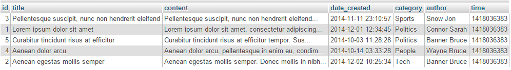

As you can see, this query returns all useful data on one line, for each article. The OpenSearchServer database crawler can read these results and write one document in the index for each line, identified by the column `id`.

> Another useful feature of the crawler is to merge several lines sharing the same unique ID. For instance, the database might use join tables and the final query would return several lines for one article, but with one different category by line. In this case the crawler can create but one document in the index by assigning multiple values to its `category` field.
>
> We will not cover this case in this tutorial though, but it's nice to know that it's possible!

To use this example as an exercise, you can download the MySQL scripts at [https://gist.github.com/AlexandreToyer/f00c3eec976e654e211b](https://gist.github.com/AlexandreToyer/f00c3eec976e654e211b) and create a local database on your computer. It could also be a PostgreSQL database, or some other kind of database.

When your database is ready go to OpenSearchServer's interface.

## Creating and configuring the index's schema and analyzers

### Creating the index

Create an empty index, named `articles`.

### Creating the analyzers

Two analyzers are needed in order to transform the data.

#### Analyzer `_KeepFirstLetterOnly`

This analyzer will be used to index the first letter of the author's name in a particular field. We will then use this field as a facet.

Go to tab `Schema` / `Analyzer` and create this analyzer:

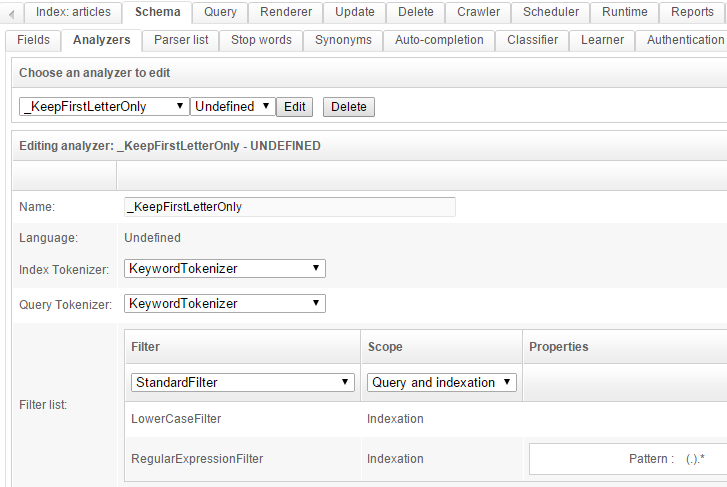

You can test it in the test area in the bottom. It will only keep the first letter of the given text.

#### Analyzer `_KeepYearMonth`

This analyzer will be used to extract the year and the month from a full date, such as `2014-10-14 10:25:34`. This data will then be used as a facet to filter on month.

Go to tab `Schema` / `Analyzer` and create this analyzer:

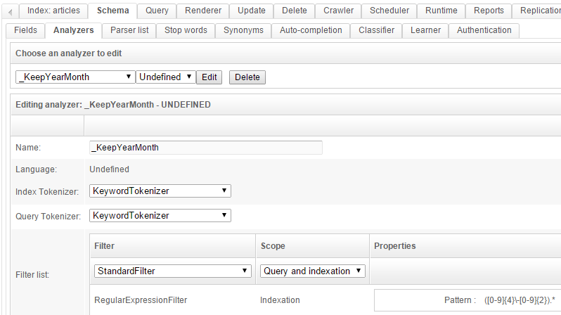

The regular expression to use here is `([0-9]{4}\-[0-9]{2}).*`.

You can also test it in the test area in the bottom.

### Creating the schema

Go to the `Schema` tab and create the following fields:

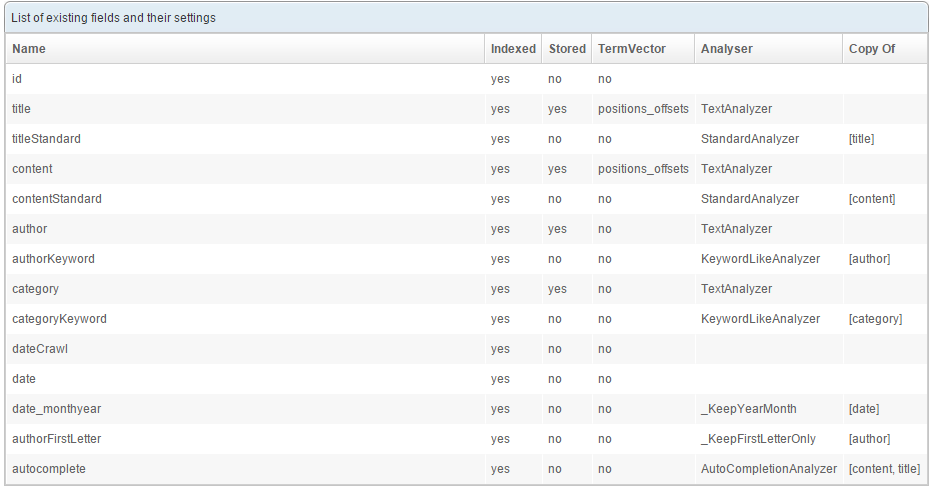

Some fields get created in several versions, each one using a particular analyzer. For instance the `title` and `titleStandard` fields both store the same value (the title of the article) but index it in a different way: the field `title` uses a `TextAnalyzer` and the field `titleStandard` uses a `StandardAnalyzer`. These fields will be assigned different weights when creating the query.

Have a look at the [How to use analyzers](../faq/indexing/how_to_use_analyzers.md) page to understand it all. 

#### Default and unique fields

Using the lists located at the top of the page (still in the `Schema`tab) configure the index with:

* Default field: `content`
* Unique field: `id`

The unique field will be used to uniquely identify the documents. When crawling the database, those articles that already exist in the index will thus be updated rather than created.

## Configuring the crawler

Here comes the part where we actually work with the database.

Go to the `Crawler` / `Database` tab and click the `New crawl...` button.

Configure the first tab as follows:
 
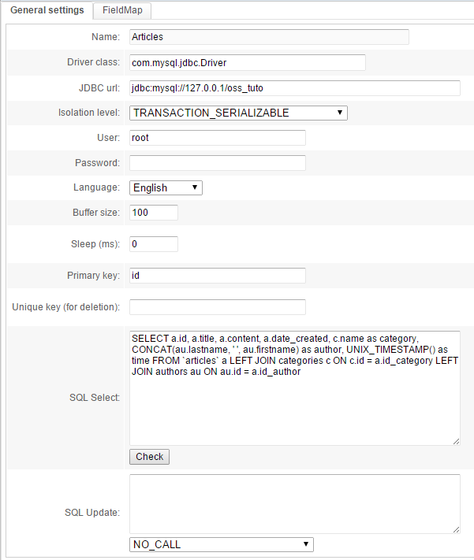

The following information is specific to your project:

* Driver class: choose the one matching your type of database
* JDBC URL: this connection string can vary depending on your type of database. For MySQL for example it will be: `jdbc:mysql://<host>:<port_if_any>/<database_name>`
* Of course the database host must be accessible from the servers used by OpenSearchServer. 
* User: a user with read rights to your database
* Password: the password for this user

The `SQL Select` query was the one discussed near the beginning of this tutorial.

The `UNIX_TIMESTAMP()` function will be used to save the time of indexing. An SQL `CONCAT` is used to concatenate lastname and firstname for the authors.

Click the `Check` button. A popup displaying the name of columns pops up:

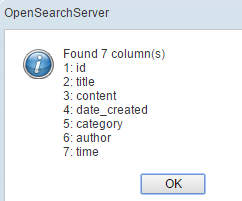

Go to the `FieldMap` tab and add these mappings:
 
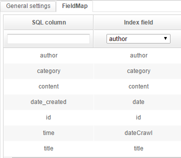

What this means is: 
* the value of each column found by the SQL query will be indexed in a particular field of the schema
* the `Copy of` feature used earlier when creating fields will be used to copy a single value value to several fields, sparing the need to add multiple mappings to those fields

Create (or Save) the Crawl and then click on the button with the green icon to start it. It should quickly say "Complete".

> If message "Error" is shown, hover over it with your mouse to get a tooltip. It may be an SQL error, or you may have forgotten some mappings in the `FieldMap` tab. The "Unique field" of the schema in particular **must have a mapped values**.

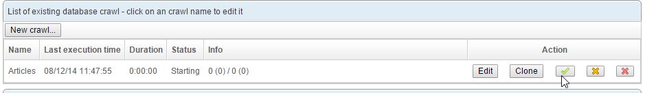

## Configuring the autocompletion

Go to the `Schema` / `Auto-completion` tab to create an autocompletion item, using the field "autocomplete": 

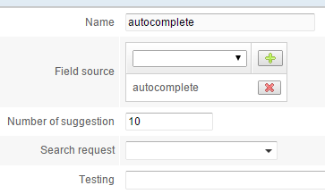

Click the `Create` button. In the list below click on the `Build` button to populate the auto-completion sub-index.

## Creating a query

The documents are now indexed, and that's half the battle. But we still need a query to search them.

Go to the `Query` tab and create a new query (type `Search (field)`), named "search". 

Configure it as shown below:

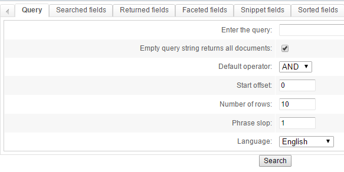

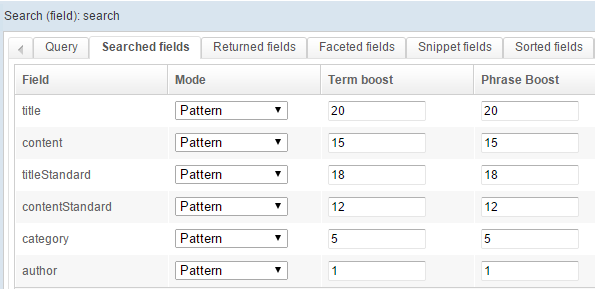


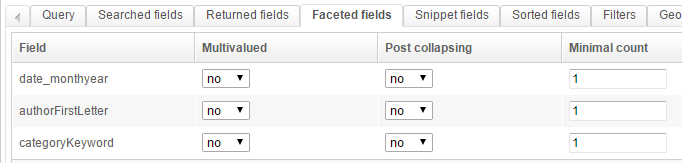

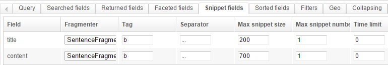

This is a fairly standard setup:
* we use a AND with a phrase slop of 1
* we search different fields, and give a different weight to those
* we want to return some fields, and create some facets
* we configure the snippets so they highlight the searched-for keywords in the results

Click the `Search` button to test it:

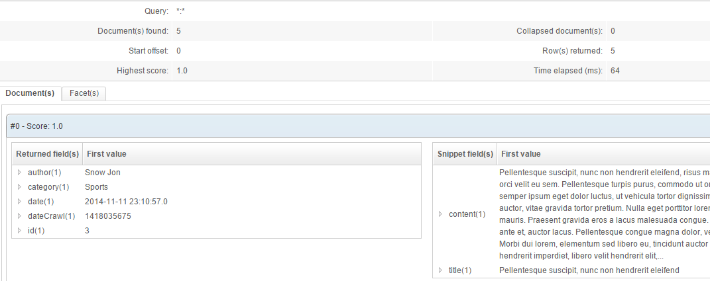
 
## Creating a renderer

The final step is to create a renderer that will use our query template.

Go to the `Renderer` tab and configure it as follows:

**Global configuration:**

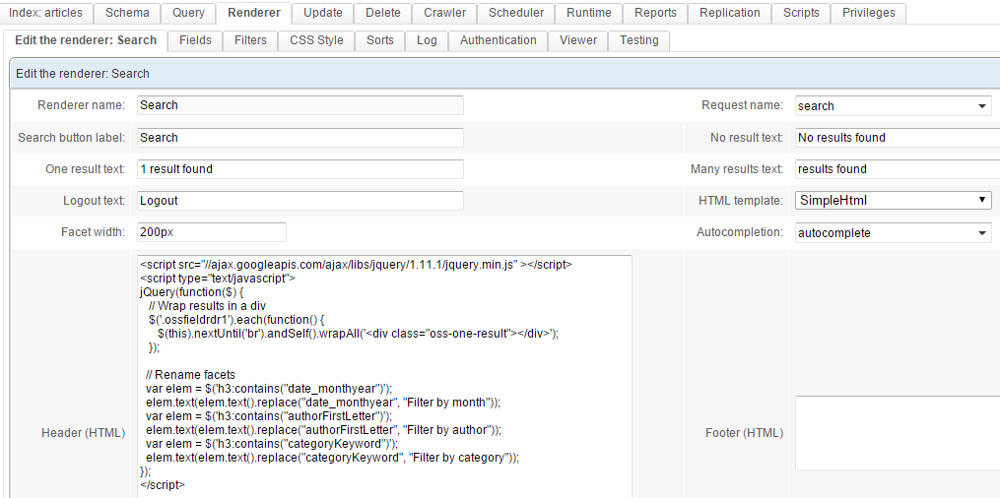

Use the query template (request) (which we named `search` in this example), and the autocompletion we created earlier. 

To enhance the display and rename facets, we'll be using some JavaScript. Specifically we'll use `jQuery` as dynamically loaded from the Google CDN. The full code is:

```javascript
<script src="//ajax.googleapis.com/ajax/libs/jquery/1.11.1/jquery.min.js" ></script>
<script type="text/javascript">

jQuery(function($) {
    
   // Wrap results in a div
   $('.ossfieldrdr1').each(function() {
      $(this).nextUntil('br').andSelf().wrapAll('<div class="oss-one-result"></div>');
   });
 
  // Rename facets
     var elem = $('h3:contains("date_monthyear")');
     elem.text(elem.text().replace("date_monthyear", "Filter by month"));
     var elem = $('h3:contains("authorFirstLetter")');
     elem.text(elem.text().replace("authorFirstLetter", "Filter by author"));
     var elem = $('h3:contains("categoryKeyword")');
     elem.text(elem.text().replace("categoryKeyword", "Filter by category"));

});

</script>
```


**Fields**

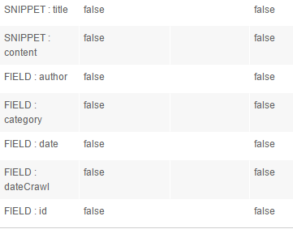

The first two lines are `SNIPPET`, the other ones are `FIELD`. We'll run a test where we display the `dateCrawl` and `id` fields.

In order to choose fields from the list `Field / Snippet`, first create the renderer (click `Create`) with a query template chosen from the `Request name` list (in the first sub-tab). Then edit it again (click `Edit` in the list of renderers and come back to the `Fields` tabs).

**CSS Style**

Now for some CSS code to beautify the results:

```css
body { font-family: Arial, sans-serif; background:#efedea; color:rgb(124, 112, 94); }
#oss-wrap { width:1000px; margin:20px auto 0 auto; font-size:14px;  line-height: 24px;}

.oss-one-result { background:white; padding:20px; margin:0 0 10px 0; border:1px solid rgb(228, 225, 220);}

/* Search box */
.ossinputrdr { height:30px; padding:3px; font-size:1em;}
/* Search button */
.ossbuttonrdr { height:40px; }
/* Num found */
.ossnumfound { margin:10px 0 0 0; }

/* Title of article */
.ossfieldrdr1 { text-align:center; color:#bd5532; font-family: Tahoma; font-size:2.1em; margin:10px 0 20px 0;}
/* Content */
.ossfieldrdr2 {}

/* Author, category, date */
.ossfieldrdr3:before { content: 'Written by: ';}
.ossfieldrdr4:before { content: ', in: '}
.ossfieldrdr5:before {content: ',  ';}
.ossfieldrdr3, .ossfieldrdr4, .ossfieldrdr5 { color:#ada393; font-style:italic; display:inline-block;}

/* For debugging purpose: Crawl date and ID article */
.ossfieldrdr6:before {content:'Last crawled time: ';}
.ossfieldrdr7:before {content:'ID: ';}
.ossfieldrdr6 { border-top:1px solid #CDCCC9; margin-top:20px;}
.ossfieldrdr6, .ossfieldrdr7 { font-size:0.9em; color:#CDCCC9;}

/* Facets */
.oss-facet h3 { color:#6f9d9f; font-family:Tahoma;}
.oss-facet a { color:#bd5532; }
.oss-facet ul { padding-left:10px;}

/* Autocomplete */
#ossautocompletelist{ background:white; padding:0px; border:1px solid rgb(228, 225, 220);}
.ossautocomplete_link , .ossautocomplete_link_over { cursor:pointer; display:block; padding:5px; }
.ossautocomplete_link_over { background:#efedea;}
```

That's it! Click `Save & close` and then click `View` in the list of renderers.

The autocompletion should be active. 

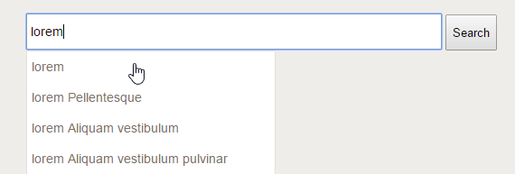

Try searching for "Lorem". Facets are dynamically loaded and can be used to easily filter content on a particular field:


## Going further

### Scheduling the crawl

The crawl process can be launched automatically on a regular basis. To do so create a job for the scheduler in the `Scheduler` tab and choose the `Database crawler - run` task. 

### Scheduling the autocompletion rebuilding

You could also want to automatically rebuild the autocompletion sub-index after each crawl. To do so simply add a `Build autocompletion` task to your previously created job of scheduler.

### Using variables when crawling

Several variables can be used in the SQL query. Values for these variable can be given at crawl time. See [How to use variables with the database crawler](../faq/crawling/how_to_use_variables_with_database_crawler.md) to discover this advanced feature.
