## Crawling a Json REST API

This quick OpenSearchServer tutorial will teach you how to crawl a JSON REST API using the REST Crawler, and how to set up an attractive search page.

During this tutorial we will crawl a YouTube API, which we will use for searching videos and playlists.

Here is an example of the end result:

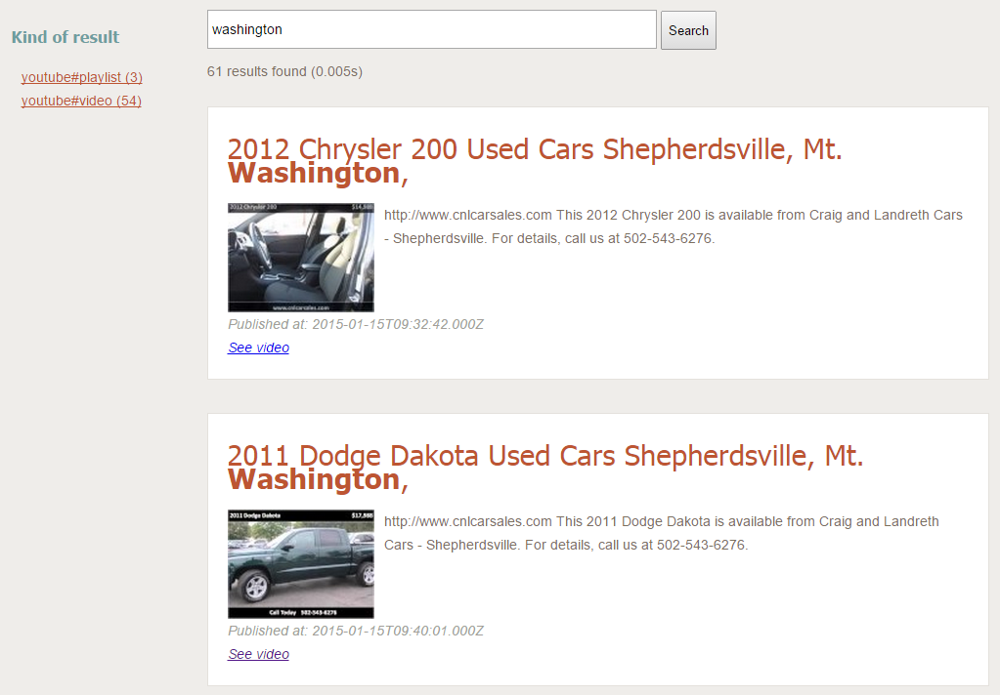

## YouTube API

For this tutorial we will use the [`Search:list`](https://developers.google.com/youtube/v3/docs/search/list) API from the YouTube V3 API.

We are using the following parameters:

* `part`: `id,snippet`
* `q`: `washington`: we want all results related to this keyword.
* `order`: `date`: results will be sorted in reverse chronological order.
* `maxResults`: `50`: up to 50 results will be returned.

The final `GET` URL is: 
[`https://www.googleapis.com/youtube/v3/search?order=date&part=id%2Csnippet&q=washington&maxResults=50&key=Your_API_Key`](https://www.googleapis.com/youtube/v3/search?order=date&part=id%2Csnippet&q=washington&maxResults=50&key=Your_API_Key)

Of course you need to replace `Your_API_Key` with your own API Key to access Google APIs.

Here is a truncated example of returned results:

```json
{
 "kind": "youtube#searchListResponse",
 "etag": "\"F9iA7pnxqNgrkOutjQAa9F2k8HY/iuZlbVAIYZertpmTcaACUh_qP1k\"",
 "nextPageToken": "CDIQAA",
 "pageInfo": {
  "totalResults": 1000000,
  "resultsPerPage": 50
 },
 "items": [
  {
   "kind": "youtube#searchResult",
   "etag": "\"F9iA7pnxqNgrkOutjQAa9F2k8HY/QjKcH-bKUnif8I1fm_iOzWTknbo\"",
   "id": {
    "kind": "youtube#video",
    "videoId": "VeYQxs331aE"
   },
   "snippet": {
    "publishedAt": "2015-01-15T09:59:34.000Z",
    "channelId": "UCnhRBZvHva5dvlVwlAYp0EA",
    "title": "2007 Pontiac G6 Used Cars Shepherdsville, Mt. Washington, Bu",
    "description": "http://www.cnlcarsales.com This 2007 Pontiac G6 is available from Craig and Landreth Cars - Shepherdsville. For details, call us at 502-543-6276.",
    "thumbnails": {
     "default": {
      "url": "https://i.ytimg.com/vi/VeYQxs331aE/default.jpg"
     },
     "medium": {
      "url": "https://i.ytimg.com/vi/VeYQxs331aE/mqdefault.jpg"
     },
     "high": {
      "url": "https://i.ytimg.com/vi/VeYQxs331aE/hqdefault.jpg"
     }
    },
    "channelTitle": "craiglandrethcars44",
    "liveBroadcastContent": "none"
   }
  },
  {
   "kind": "youtube#searchResult",
   "etag": "\"F9iA7pnxqNgrkOutjQAa9F2k8HY/esnPEWWR9vjjdYHlIFRmqVyRp0s\"",
   "id": {
    "kind": "youtube#video",
    "videoId": "RxXhn04C5yI"
   },
   "snippet": {
    "publishedAt": "2015-01-15T09:51:12.000Z",
    "channelId": "UC62jzbz_gSjgKHTkMfe7P1A",
    "title": "Oregon State Beavers vs Washington Huskies Free Pick NCAA Prediction Thursday 1-15-2015 Preview",
    "description": "Are you planning to watch the NCAA college basketball game between the Washington Huskies versus the Oregon State Beavers on Thursday January 15th ...",
    "thumbnails": {
     "default": {
      "url": "https://i.ytimg.com/vi/RxXhn04C5yI/default.jpg"
     },
     "medium": {
      "url": "https://i.ytimg.com/vi/RxXhn04C5yI/mqdefault.jpg"
     },
     "high": {
      "url": "https://i.ytimg.com/vi/RxXhn04C5yI/hqdefault.jpg"
     }
    },
    "channelTitle": "DaveScandaliato",
    "liveBroadcastContent": "none"
   }
  },
```

Note the `items` array, containing several objects. For each of these objects we will create one document in the index.

### Creating the schema

Create an empty index named `youtube`, then go to the `Schema` tab and create the following fields:

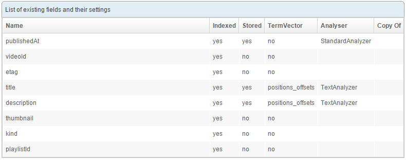

#### Default and unique fields

Using the lists located at the top of the page (still in the `Schema` tab) configure the index with:

* Default field: `title`
* Unique field: `etag`

The unique field will be used to uniquely identify the documents. When crawling the REST API, documents that already exist in the index will thus be updated rather than created.

## Configuring the REST crawler

Here comes the part where we actually fetch and index information from the REST API.

Go to the `Crawler` / `REST` tab and click the `New crawl...` button.

Configure the first tab as follows:
 
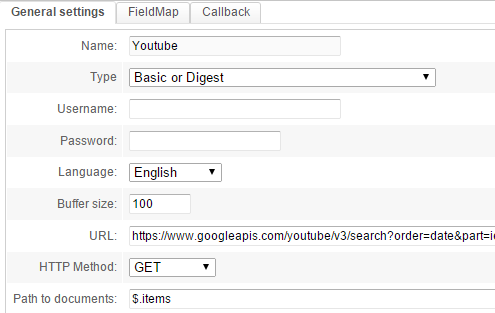

The parameters are:

* `Name`: use `Youtube` for example.
* `Language`: we will index content in English, thus choose `English`.
* `Buffer size`: leave the default value of `100`.
* `URL`: this is where you can define the URL to fetch.
* `HTTP Method`: the YouTube API is accessed with a `GET` request.
* `Path to documents`: enter a [JSONPath](http://goessner.net/articles/JsonPath/) expression to tell the crawler where the documents are in the JSON result. In this case they are in the `items` array, at the root of the global JSON result. Thus, the expression `$.items` will match this array.

Go to the `FieldMap` tab and add these mappings:
 


Here we simply connect different information from each object to their related fields in the schema. 
JSONPath is used to easily get values from a complex JSON structure. For instance, assuming this JSON:

```
  {
   "kind": "youtube#searchResult",
   ...
   "snippet": {
    ...
    "thumbnails": {
     "default": {
      "url": "https://i.ytimg.com/vi/RxXhn04C5yI/default.jpg"
     },
  ...
```

The JSONPath expression `$.snippet.thumbnails.default.url` will get the URL for the default thumbnail.

Create (or Save) the Crawl and then click in the list, on the button with the green icon, to start it. It should quickly say "Complete".

> If you get the "Error" message, hover over it with your mouse to get a tooltip. If the message says `The unique key is missing: etag` that is because you forgot to link the **etag** field to `$.etag`.

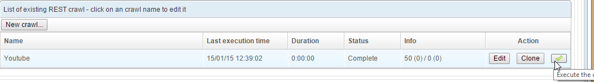

## Creating a query

The documents are now indexed, and that's half the battle. But we still need a query to search our index.

Go to the `Query` tab and create a new query (type `Search (field)`), named "search". 

Configure it as shown below:

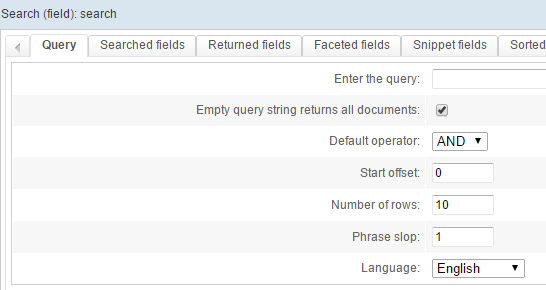

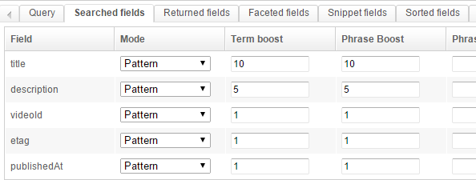

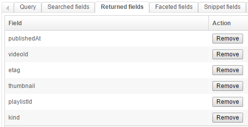

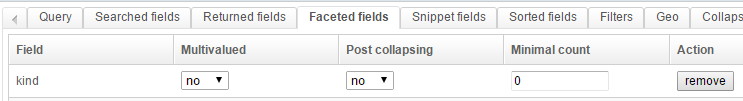

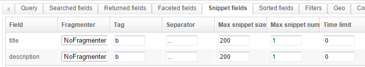

This is a fairly standard setup:

* we use an AND with a phrase slop of 1
* we search different fields
* we want to return some fields, and create one facet on the `kind` field
* we configure the snippets so they highlight the searched-for keywords in the results

You may test it directly:

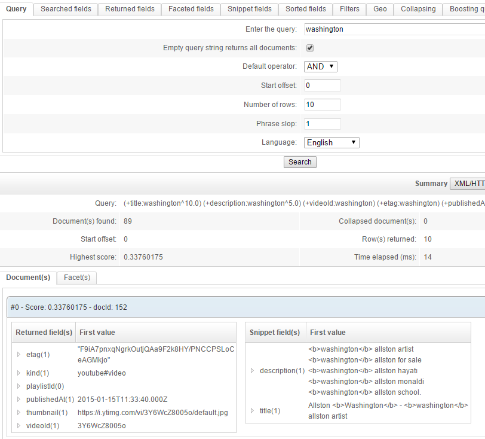
 
## Creating a renderer

The final step is to create a renderer for our query template.

Go to the `Renderer` tab and configure it as follows:

**Global configuration:**

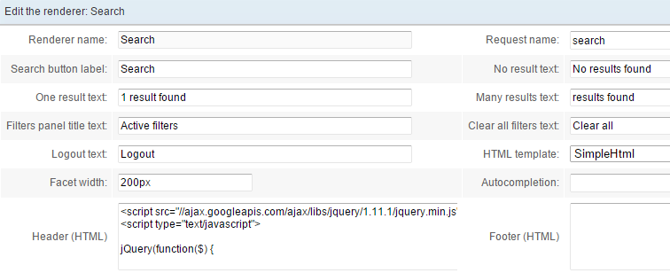

Use the query template (request) (which we named `search` in this example).

To enhance the display and add links to the results we'll be using some JavaScript. Specifically we'll use `jQuery` as dynamically loaded from the Google CDN. The full code is:

```javascript
<script src="//ajax.googleapis.com/ajax/libs/jquery/1.11.1/jquery.min.js" ></script>
<script type="text/javascript">

jQuery(function($) {
    
   // Wrap results in a div
   $('.ossfieldrdr1').each(function() {
      $(this).nextUntil('br').andSelf().wrapAll('<div class="oss-one-result"></div>');
   });
 
   var urlVideoPrefix = "https://www.youtube.com/watch?v=";
   var urlPlaylistPrefix = "https://www.youtube.com/playlist?list=";

   // Add class to fields
   $('.ossfieldrdr5').addClass('oss-video-id');
   $('.ossfieldrdr6').addClass('oss-playlist-id');
   $('.ossfieldrdr7').addClass('oss-kind-video');

   $('.oss-one-result').each(function() {
      var kind = $(this).find('.oss-kind-video').html().trim();    
      if("youtube#playlist" == kind) {
       $(this).find('.oss-playlist-id').html('<a target="_blank" href="'+urlPlaylistPrefix + $(this).find('.oss-playlist-id').html()+'">See playlist</a>');
      } else if ("youtube#video" == kind) {
       $(this).find('.oss-video-id').html('<a target="_blank" href="'+urlVideoPrefix + $(this).find('.oss-video-id').html()+'">See video</a>');
      }
    });   
});

</script>
```

**Fields**

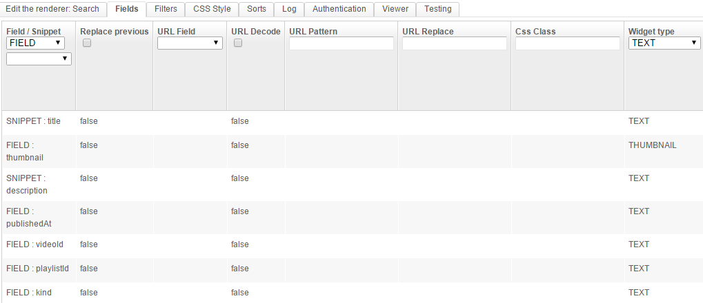

Here we are using SNIPPET for the `title` and `description` and FIELD for the other fields.

In order to choose fields from the list `Field / Snippet`, first create the renderer (click `Create`) with a query template chosen from the `Request name` list (in the first sub-tab). Then edit it again (click `Edit` in the list of renderers and come back to the `Fields` tabs).

**Filters**

We configure a proper name for the facet on the `kind` field.

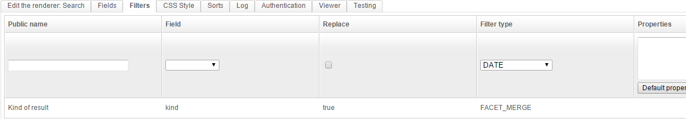

**CSS Style**

Now for some CSS code to beautify the results:

```css
body { font-family: Arial, sans-serif; background:#efedea; color:rgb(124, 112, 94); }
#oss-wrap { width:1000px; margin:20px auto 0 auto; font-size:14px;  line-height: 24px;}

.oss-one-result { background:white; padding:20px; margin:0 0 10px 0; border:1px solid rgb(228, 225, 220);}

/* Search box */
.ossinputrdr { height:30px; padding:3px; font-size:1em;}
/* Search button */
.ossbuttonrdr { height:40px; }
/* Num found */
.ossnumfound { margin:10px 0 0 0; }

/* Title */
.ossfieldrdr1 { text-align:left; color:#bd5532; font-family: Tahoma; font-size:2.1em; margin:10px 0 20px 0;}

/* Image */
.ossfieldrdr2 { width:150px; float:left; margin:0 10px 0 0; }

.ossfieldrdr4 { clear:both; }
.ossfieldrdr4:before { content: 'Published at: '}
.ossfieldrdr4, .ossfieldrdr5 { color:rgb(163, 159, 153); font-style:italic; }

/* type */
.ossfieldrdr7 { visibility:hidden; display:none;}

/* Facets */
.oss-facet h3 { color:#6f9d9f; font-family:Tahoma;}
.oss-facet a { color:#bd5532; }
.oss-facet ul { padding-left:10px;}
```

That's it! Click `Save & close` and then click `View` in the list of renderers.

Try searching for "washington". The facet is dynamically loaded and can be used to easily filter content according to its type.

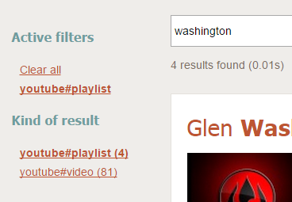


## Going further

### Scheduling the crawl

The crawl process can be launched automatically on a regular basis. To do so create a job for the scheduler in the `Scheduler` tab and choose the `REST crawler - run` task. 

### Using variables when crawling

Multiple variables can be used in the URL to fetch. For instance one might use the same REST Crawler to search for different keywords with the YouTube API (parameter `q`).

To do so:

* edit the renderer and in the URL replace `q=washington` with `q={keyword}`

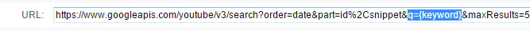

* create a job in the Scheduler with a `REST crawler - run` task:
    * choose your crawler
    * In the `Variables (JSON)` field, write `{"keyword":"apple"} `  

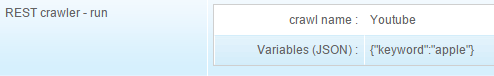

It is also possible to run this Scheduler job _through_ the dedicated API: [Running a task in the scheduler](http://www.opensearchserver.com/documentation/api_v2/scheduler/run.md). If you want to execute a job with this API you will need to delete the `Variables (JSON)` from the job. Variables in this field will **not** be overidden by the ones set in the API call.

Here is an example using the POSTMAN extension for Chrome:

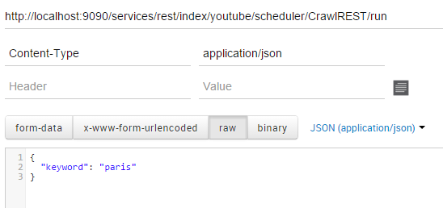
