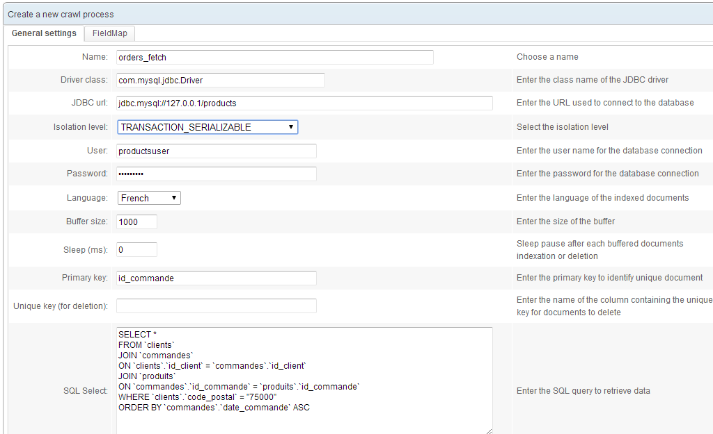
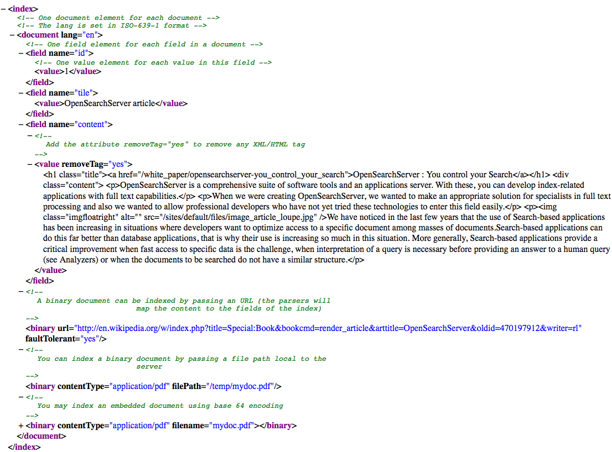
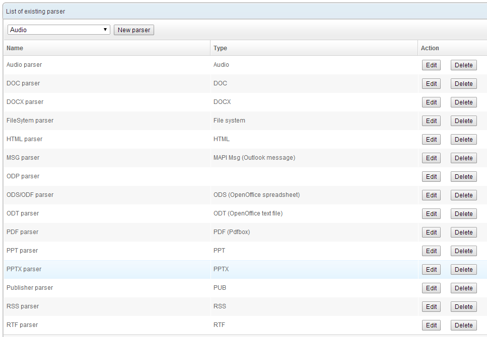
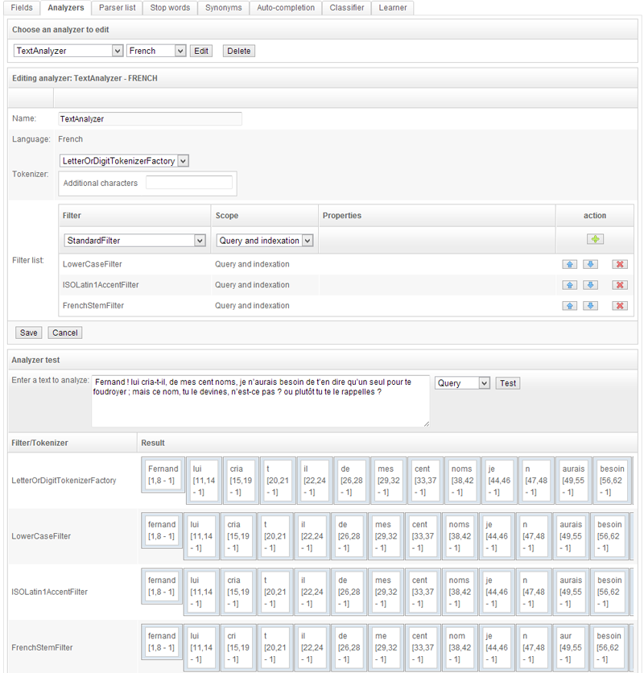
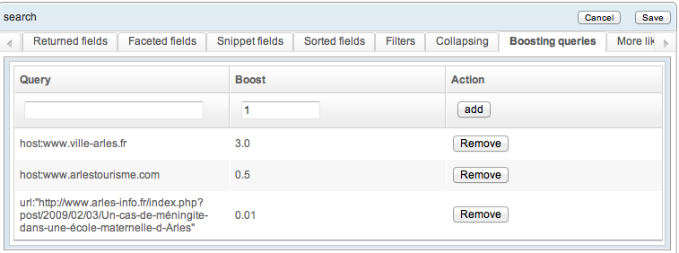
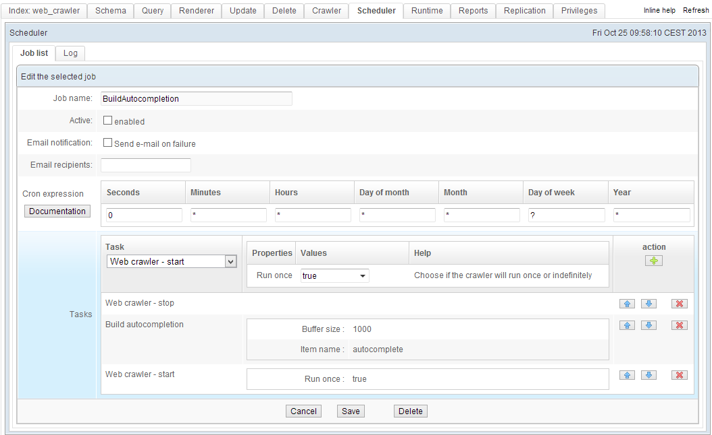

# Discovering the main concepts

OpenSearchServer (OSS) is a search engine running on a Windows, Linux or Solaris server.

Its **GUI** can be used via any **web browser** supporting Ajax (Internet Explorer, Firefox, Safari, Chrome). Said interface gives access to all of OSS' functions.

OSS also offers a full set of **REST** and **SOAP** APIs, facilitating integration with other applications.

Client libraries in PHP, PERL and ASP.NET allow for easy integration with PHP-based and Microsoft-based environments.

OpenSearchServer further offers a **Drupal** module and a **Wordpress** plugin, and can be integrated with these CMSes without development work. A coder familiar with Drupal and/or Wordpress will find it easy to customise these OSS resources.


# Indexing
To index content, OpenSearchServer can deploy the following:
- **crawlers** fetching data according to the rules they have been given
- **parsers** extracting the data to be indexed (full-text) from what has been crawled
- **analyzers** applying semantic and linguistic rules to the indexed data
- **classifiers** adding external information to the indexed documents
- **learners** parsing indexed documents to deduce their categories

## Crawlers
OpenSearchServer offers four kinds of crawlers
- Web crawlers
- File system crawlers
- Database crawlers
- XML file crawler

### Web crawler
This crawler handles HTTP and HTTPS - and is thus used to crawl Internet, intranet and extranet sites. It offers the following functions:
- **Website list**. A list of URLs, which can include wildcards (noted with a * character). This allows for the full or partial indexation of a website.
- **Exclusion list**. Another list of URLs that can use wildcards, but this one excludes pages from being indexed.
- **URL parameters filtering**. It is possible to ignore unimportant data in URLs (for instance, session parameters)
- **URLs browser**. This interface is used to review all known URLs and their status (indexed, unindexed, 404 error, etc.)
- **Crawl process manager**. This interface is used to monitor the indexation process - number of simultaneous threads, crawling speed for each site, number of pages per session, etc.
- **Manual crawling**. Used to test the indexation of a given URL.
- **Proxy**. An HTTP and/or HTTPS proxy can be used while indexing.
- **Screenshot**. Takes a snapshot of the indexed pages.
- **Authentication**. To access secure websites.
- **Robots.txt protocol**. OpenSearchServer obeys the robots.txt instructions.
- **Extraction of specific data**. Specified MIME types, URLs, etc.
 


### File system crawler
This crawler will index local or remote file systems. It can:
- Index **local files** by crawling the local file system and the NFS and CIFS mount points.
- Index **remote files** using the following protocols: CIFS/SMB, FTP, FTPS.
- Browse **file attributes**. This parses files and folders and lists useful information (indexed or unindexed, file size, document type, etc.)


### Database crawler
This crawler indexes structured data from database tables. It can:
- Access most databases through JDBC: MySQL, SQLServer, PostgreSQL, Oracle, Sybase, DB2...
- Index using **SQL queries**, and handle join clauses by recognising their primary keys.
- Index **attachments** whose local path or URL are given in the schema.
- Prune **HTML tags** before indexing.
- Convert **HTML entities**.
- Apply **regular expressions** before indexing.
 


### XML file crawler
Data can be uploaded as an XML file. OpenSearchServer offers it own native XML format. This simple but powerful format can easily be generated, for instance to export then apply an XSL transformation.
This native XML format can:
- Index structured data by labelling each file.
- Index **embedded attachments** within the XML file (using base64 encoding).
- Index **local files** by following a given path.
- Index **attached remote files** by opening a given URL.
- Automatically prune **HTML tags**.
- Convert **HTML entities**.
- Apply a **regular expression** on each field before indexing it.

Here is an example of a native OSS format XML file :



## Parsers
The job of a parser is to **extract data to be indexed** from the documents fetched by these crawlers. The parser is **automatically selected** according to the MIME type (if the crawler can find it) or the file extension. Each parser can be given a maximum size for the files to be indexed.

The following formats are supported by default:
- Microsoft Word files with a .doc (Word 6, Word 95, Word 97-2007) or a .docx extension.
- Microsoft Excel files with an .xls (Excel 97-2007) or .xlsx extension.
- Microsoft PowerPoint files with a .ppt (PowerPoint 97-2007) or .pptx extension.
- HTML/XHTML.
- OpenOffice files with an .odt, .ods or .odf extension.
- Adobe PDF.
- RTF (Rich Text Format) files.
- The metadata of audio files with a .wav, .mp3, .aif or .off extension.
- .txt files (the encoding is automatically detected).

More formats can be supported using OpenSearchServer plugins. The OSS community has developed several, and support is available to either integrate those or develop new ones.

Such plugins include :
- Torrent files (indexation of their metadata).
- Microsoft Publisher files.
- Microsoft VISIO files.
- Microsoft Outlook files.



Each parser provides information that is integrated within the index. For instance, the Microsoft Office, OpenOffice and PDF parsers specifically provide a document's title, author and content. The HTML/XHTML parser identifies each link on the page, each page's title, etc.

A simple **field mapping system** can dispatch this data to specific fields, and data from the parsers can be **processed using regular expressions**. 

Lastly, a field can be **multivalued**.


## Analyzers
The analyzers process text information provided by the parsers. Their job is to apply semantic and linguistic treatments to make it easier for searches to find pertinent results. One example is finding slightly misspelled words. An unlimited number of analyzers can be defined, and applied to selected fields within the index.



Analyzers include a tokenizer, which hashes texts into `tokens`, and a series of configurable filters processing the tokenized texts. Such processes include:

### Lemmatization
Lemmatization identifies the root of words, so their inflected form can be identified as related. For instance "skating" will also be indexed as "skate", albeit with a lower pertinence score.

OpenSearchServer can lemmatize words in **17 languages** : German, English, Arabic, Chinese, Danish, Spanish, Finnish, French, Dutch, Hungarian, Italian, Norwegian, Portuguese, Romanian, Russian, Swedish, Turkish.

### N-grams
N-grams hash words into one-syllable subsequences. With size two n-grams, the word "skating" would also be indexed as "sk", "ka", "at", "ti" and so on. This is primarily used to identify misspellings such as "skkatting".

### Shingling
Shingling identifies several forms of a word as meaning the same thing. For instance, the acronym "I.B.M." or "I B M" or "I-B-M" and so on and so forth will be indexed as "IBM".

### Diacritics reduction
This replaces letters that include diacritics and accents with their baseline equivalent. For instance the French word "côté" will become "cote".

### Stop words
This filter ignores certain words, which are considered as being low-value within the indexed corpus. The stop words list can be specified for each language.

### Synonyms
This filter locates documents by using a parametrable list of synonyms. For instance a search for "mirth" could also provide results with "merriment" or "jollity".

### Case sensitivity
This filter ignores whether letters are in lower or upper case. Thus the word "Bear" will also be indexed as "bear".

### Capture and replacement with regexes
This filter applies a regular expression to the text. A typical example is transforming a DD/MM/YYYY format date into a YYYYMMDD date, with the capture expression being `^([0-9]*)/([0-9]*)/([0-9]*)$` and the returned string being `$3$2$1`.

### Other filters
Many other filters are available - degrees-to-radians conversion, numbers formatting, de-doubling words, extracting the domain name out of an URL, normalising URLs, procuring the title and description of a YouTube video based on its URL, etc.


## Classifiers
This module adds data to an indexed document. A series of queries is executed, and each successful query **adds a specified keyword to the document** in a specified field.
In practice, this is usually used to :
- Automatically sort indexed documents (by assigning them to a group of sites, a category...).
- Associate keywords to documents.
- Manage sponsored links.


## Learners
This module has two parts. The first **learns by parsing documents that have already been categorised**. A typical corpus is a database of articles and categories.

The second part is usually used when indexing a document. The learner analyzes the document, draws from what was learned by the first module, and suggests a classification. A typical example would be suggesting categories for a new document.

# Queries
The querying module can create any number of query templates, each with its own parameters.


## Two kinds of queries

### Field queries
Search (field) queries simplify building querying templates. Using these is as simple as selecting the fields of the schema in which to run the full-text search, and the **relative weight** of each such field when computing the relevance of a document.

Each field can be configured in four ways:
- Pattern: the keywords stay unprocessed - this is closer to pattern queries, which we will cover later.
- Term: extraneous characters in the query (quote marks, symbols, etc.) are deleted, and the search is run on each term in the query. For instance a search for `lorem ipsum` would actually be a search for `lorem` followed by a search for `ipsum`.
- Phrase: the query is cleaned up as above, but will search **for the whole phrase**. Thus a search for `lorem ipsum` will only search for `lorem ipsum`.
- Term & Phrase: A combination of these two modes. Thus a search for `lorem ipsum` will run three successive searches for `lorem`, `ipsum` and finally `lorem ipsum`.


### Pattern queries
Search (pattern) queries make use of a specific querying language to designate the fields to be full-text searched.

Here are the elements of syntax used to compute relevance:
- **Boolean operators**, namely AND OR NOT + - . For instance the query `+Madden -2012` looks for documents that must contain the word `Madden` but not the word `2012`.
- **Proximity search**. Using quote marks in the query allows for searching for a phrase rather than for separate words. An allowance for distance between these words can be specified.
- **Search in specific fields**. The search will only cover certain fields, such as the title of the documents.
- **Weighted search**. A relative weight can be assigned to each component of the search, to give more importance to a word or a field. This is commonly used to assign a higher weight to the title of a document.
- **Search range**. A search can be constrained between two specific dates, or more generally between two specified values.

Here is an example of a query template:
```
title:($$)^10 OR title:("$$")^10 OR
url:($$)^5 OR url:("$$")^5  OR
content:($$) OR content:("$$")
```

In queries based on this template:
- The $$ strings are replaced by the keywords the user is searching for.
- If these words are found in the title field or the URL field, they receive a tenfold or fivefold weight for relevance computations.
- The keywords are searched for as independent entities, but also as a phrase (proximity search using quote marks)


## Facets and filters
These two functions are often used in unison, and will thus be introduced together.

### Facets
These **count the number of results per entity**. An "entity" can be a category, a domain name, a specified number of links, dates, etc. Any value indexed within a field can become a facet.

Typical uses are providing the number of results per website on the search results page -- or the number of results per concept, for a number of specified time spans, etc.

Facets can work singularly, or be grouped - see below.


### Filters
This function usually goes hand-in-hand with facets. A search can be filtered using a subquery written in the same querying language used in the pattern queries section above.

For instance, a search could be constrained to a domain name, a given timespan, etc.


## Grouping
Documents can be grouped to make the results list more intelligible and less repetitive. For instance, one might limit to three the maximum number of consecutive results from a given website.

The different kinds of grouping are:
- **Optimised successive grouping**: limits the number of consecutive results within search results, as optimised for large volumes of results
- **Complete successive grouping**: limits the number of consecutive results throughout the entire set of search results (and not just within a given page of results)
- **Simple grouping**: limits the number of results, whether successive or not, throughout the entire set of search results.

## Text snippets
When rendering search results, OpenSearchServer can return the indexed field as is, or create a smart text snippet.

Text snippets follow guidelines such as:
- **Maximum number of characters**. The snippet will not be longer than this.
- **Searched-for keywords highlighted**. The tag used to highlight words in results listings is parametrable.
- **Snippet relevance**. OpenSearchServer returns the phrase most relevant to the searched-for keywords, while staying close to the target length.
- **Phrase detection**. OpenSearchServer attempts to return the beginning of a relevant sentence as a snippet.


## Sorting
The default sorting of results for a search engine is done using the relevance score from the search algorithm (Vector Space Model). As previously discussed, this score can be refined using the querying language.

Sorting can also be based on a given field, just like with a database. A typical example is to sort results in reverse chronological order.

Scores and fields can also be mixed. For instance, results with an identical score could be sorted in chronological order.

## Geolocation
**Geolocation filters** can easily be integrated into a query, provided that the schema of the index includes location fields (latitude and longitude).

With such a filter, only the documents within a given geographical rectangle will be returned. Distance between the documents and the central point will also be computed and returned.

Coordinates can be expressed in degrees or in radians, and the distances in kilometers or miles.

## Boosting subqueries
Boosting subqueries tweak the relevance score of documents using arbitrary parameters.



These subqueries can both bolster or lower a document's score. Results from a given website can thus be promoted, or documents from a given category can have their score lowered.

Multiple subqueries can apply to any given search.

## Joins
A search can join with one or more indexes to return more information. Such join clauses can be finely tuned, and the data can be filtered or sorted before it is displayed.

## Related documents
This function returns documents similar to a given document. This computation is based on a shared corpus of words and concepts.

This module offers fine tuning possibilities:
- Maximum and minimum length of words within the corpus.
- Stop words list.
- Lowest acceptable frequency of the word within the corpus.

## Spell check
The spell check module suggests alternative spellings. The available algorithms are:
- Jaro-Winkler distance.
- Levenshtein distance.
- N-grams distance.

## Extracting named entities
This special-purpose query can extract named entities from a relevant index. This query can in turn be used within another index, through an analyzer filter.

This allows for automated systems to extract named entities from indexed texts. For instance one could have two indexes, one with named entities (say, lists of town names or person names) and the other with newspaper articles. For each new article being indexed, the second index could run a named entities extraction query in the first index, and record in a given field of the schema a list of towns and persons mentioned within the article.

## Autocomplete
Word completion can be set up with but a few clicks. The fields used to generate suggestions can be freely chosen.

OpenSearchServer comes with a pre-packaged auto-completion engine, processing the indexed data in an optimized manner to offer the most relevant suggestions.

Multiple autocomplete indexes can be set up -- for instance to offer users from different areas suggestions drawing from different fields within the same index.


## Search page rendering
OpenSearchServer's Renderer module offers fast access to a **full search results page**. This page can easily be customised using Cascading Style Sheets. Which information should be displayed for each result can be precisely selected. Links and images can be embedded within results.

OpenSearchServer's ready-to-use code can be used to embed the results page within another application, using an iFrame.


## Authentication
A sign-in procedure can be set up for the search results pages. This allows for sorting the search result based on user profiles (by username and/or by group), using values stored in specific fields of the schema during indexation.

The Renderer module comes with this option built-in, and includes an authentication form.

# Ancillary tools
The following tools are used to run large-scale processes. They allow for monitoring the search engine, automating tasks, and generating statistics about use.

## Automation
The Scheduler module can automate complex processes. Common uses are to deploy specific indexation strategies, or replicate indexes over multiple servers. **Tasks can be scheduled** using `crontab` syntax.

The Scheduler module can run the following tasks:
- Launch a database crawler.
- Crawl XML documents.
- Start/stop a website crawler.
- Start/stop a file system crawler.
- Index optimization.
- Index replication.
- Deletion queries.
- Load logs.
- Delete the entire content of an index.
- Download an XML file from a FTP server for XSL processing.
- Merge indexes.
- **Run a task within another index** (local or remote).
- Import documents from another index (local or distant) to be reprocessed for indexation.
- Re-index words within autocomplete indexes.



## Replicating, and creating backups
The Replication module can copy an index on the same server, or on a remote server. This can be done manually or through the Scheduler.

Typical use cases for replication are:
- **Distributing** an index over a servers cluster, without interrupting its functioning.
- **Creating backups** locally or on a remote cluster.


## Monitoring
The Runtime module provides useful metrics such as memory use or free disk space, and is integrated within the GUI. An XML/HTTP API is available to interface with another monitoring application.


## Statistics
The statistics tool include two modules - the daily logs, and the visual interface.

### Daily logs
The logs will index the following data for each search:
- Timestamp.
- Keywords.
- Number of returned documents.

When combined with the front office, additional information becomes available:
- Session ID.
- Remote IP address.
- User name.

The log files can be exported into statistics management applications.

### Visual interface
This interface displays which keywords are the most frequently searched for, and which searches fail to produce any result.

The display can be constrained to a given timeframe, and the report can be exported as a CSV file.

