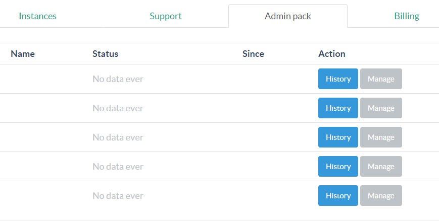
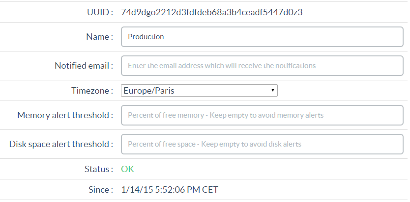
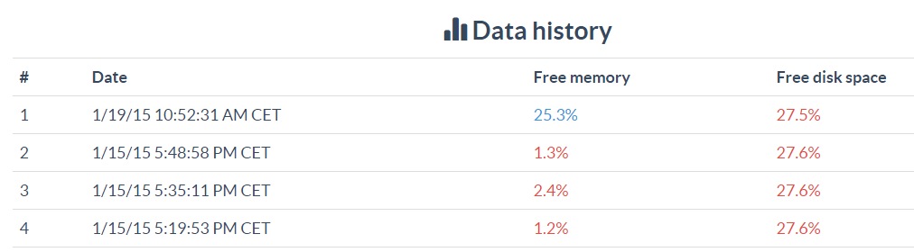
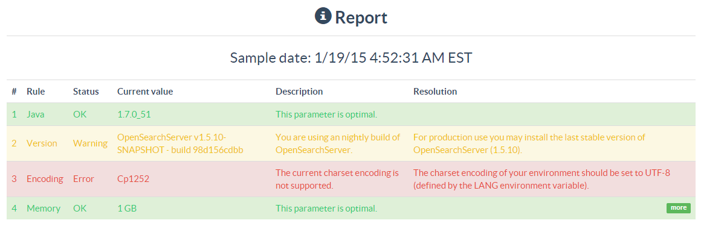

## What is OpenSearchServer Admin Pack

Admin Pack is a reliable, easy-to-use monitoring service for your OpenSearchServer instances.

**You have to use OpenSearchServer version 1.5.10 or greater** to be able to use this service.

## Features

1. Getting a **status notification via e-mail** when **the status of your instance changes**. The statuses are:
    * `No data`: if no data has been received from your instance in the last 5 minutes.
    * `OK`: if previous status was `No data` and new data has been received in the last 5 minutes.
2. Getting a **threshold notification via e-mail** as soon as **free memory** or **free disk space** drops **under a configurable threshold**.

_More features will come soon in version 2 of Admin Pack._

Each Admin Pack can monitor **5 OpenSearchServer instances**. You can get multiple Admin Packs.

### Configuring an Admin Pack

When logged in to your dashboard on [http://www.opensearchserver.com](http://www.opensearchserver.com) go to the **Admin Pack** tab.

If you just subscribed to an Admin Pack you will see 5 lines here. Click on the **Manage** button on the first line.

On this page you will be able to:

* get the `UUID` needed to configure your OpenSearchServer instance.
* give a `name` to this monitoring tool. This name will be used in the notification e-mails.
* choose the e-mail address to send notifications to.
* choose a `Timezone`. This timezone will be used for all date information in the notifications.
* configure a `Free memory threshold`. If you do not want to enable the free memory threshold notification, just leave this field empty.
* configure a `Free disk space threshold`. If you do not want to enable the free disk space threshold notification, just leave this field empty.
* get the last `Status` for this monitoring tool.
* get the last time the status changed.

Give a name to this monitoring tool, configure an e-mail address, a timezone, some thresholds if desired, and copy the `UUID`.

### Configuring an OpenSearchServer instance

The OpenSearchServer instance you want to monitor must now be configured to regularly send data to the OpenSearchServer monitoring service. This is a quick and easy process.

1. Choose an existing index. 
    * _You may want to create a dedicated empty index for this process. It will only use one job in the scheduler._
2. Go to the Scheduler tab, click on the "Create new scheduler job" button
	* Give a name to the job, for example **Monitoring**.
	* Tick the **`Enabled` checkbox**.
	* For the CRON expression, write `0/4` in the `Minutes` field and leave the other fields with their default values. The full expression is thus `0 0/4 * * * ? *`
	* Add one task: `Monitoring upload`
		* Leave the default value in the `URL` field -- `https://cloud.opensearchserver.com/oss-monitor/`.
		* Leave the `Login` and `Password` fields empty.  
		* Paste the previously copied `UUID` in the `Instance ID` field
	* Click the **Create** button.

That's it! This job will now run every 4 minutes. It will post monitoring information to your Admin Pack. You will receive immediate e-mail notification when the status changes.  

### Viewing history and reports

In the Admin Pack tab of your dashboard you will also be able to access the **history** of the received monitoring information by clicking on the History button:

Clicking the **Report** button you will get an analysis of several values sent by the monitoring process. It can help you improving your experience with OpenSearchServer:

