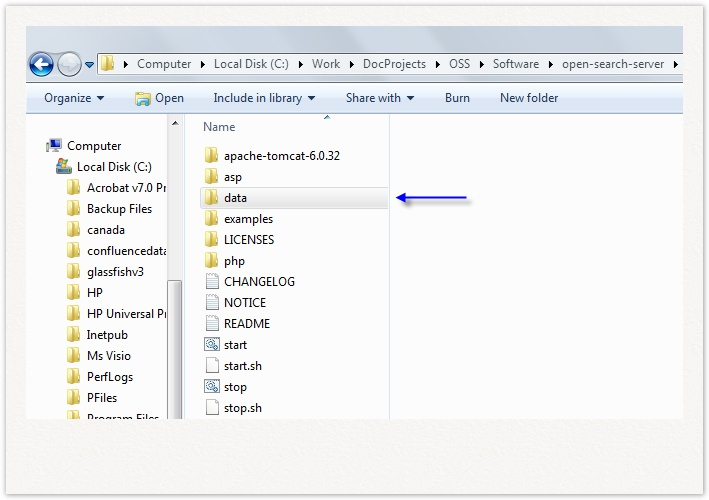

Si vous avez oublié votre nom d'utilisateur ou votre mot de passe suivez ces étapes :

1. Stopper OpenSearchServer,
2. Rendez-vous dans le dossier hébergeant OpenSearchServer et entrez dans le dossier `data`,
3. Dans le dossier `data` supprimez le fichier `users.xml`,
4. Redémarrez OpenSearchServer : l'instance est de nouveau non protégée, créez un nouveau compte pour la sécuriser.

