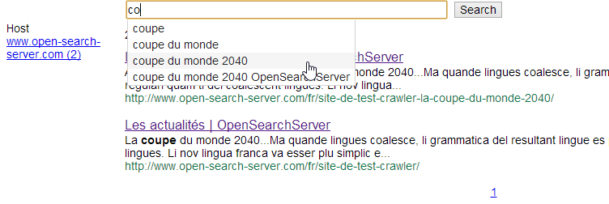
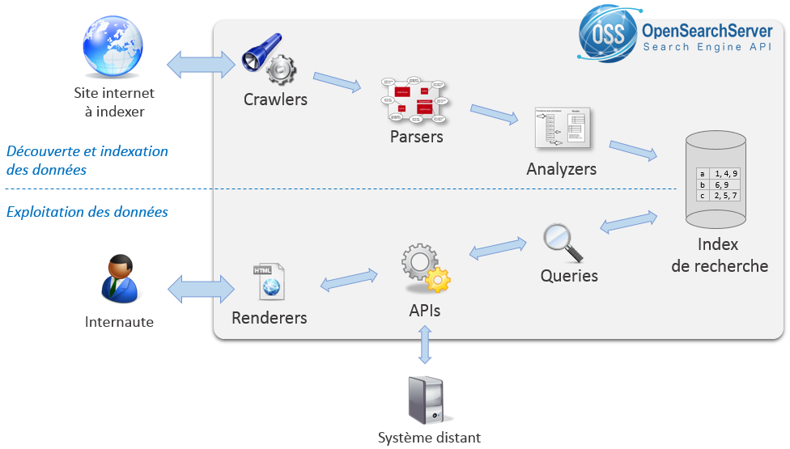
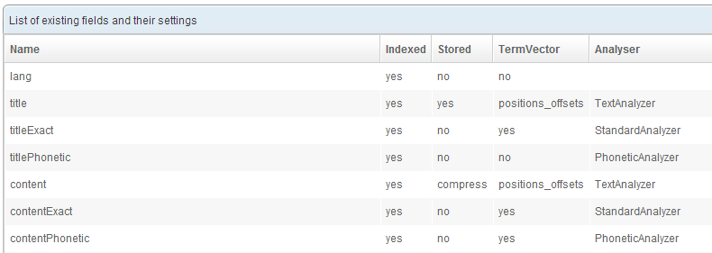
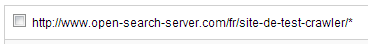

Ce tutoriel simple permet de prendre rapidement en main les principales fonctionnalités d'[OpenSearchServer](http://www.open-search-server.com/fr).
Ce tutoriel a été écrit pour la version 1.5.0 d'OpenSearchServer.

Vous apprendrez à :

* **crawler un site web**,
* **construire l'index de recherche**, 
* mettre en place **une page de recherche** paginée avec **autocomplétion** et **extraits de résultats**, 
* **configurer des facettes**, 

Voici la page de recherche finale que nous obtiendrons :

Pour illustrer notre tutoriel, nous avons pris l’exemple d’un site d'actualités. Nous avons créé pour cela 4 pages fictives :

* [http://www.open-search-server.com/fr/site-de-test-crawler/](http://www.open-search-server.com/fr/site-de-test-crawler/)
  * [http://www.open-search-server.com/fr/site-de-test-crawler-le-chomage-est-en-baisse/](http://www.open-search-server.com/fr/site-de-test-crawler-le-chomage-est-en-baisse/)
  * [http://www.open-search-server.com/fr/site-de-test-crawler-la-coupe-du-monde-2040](http://www.open-search-server.com/fr/site-de-test-crawler-la-coupe-du-monde-2040/)
  * [http://www.open-search-server.com/fr/site-de-test-crawler-la-ceremonie-des-oscars/](http://www.open-search-server.com/fr/site-de-test-crawler-la-ceremonie-des-oscars/)

Pour commencer il vous suffit d'[Installer OpenSearchServer en 3 minutes](http://www.open-search-server.com/fr/tester-opensearchserver).

## Quelques définitions

Avant de démarrer ce tutoriel il est important de connaitre les principaux constituants d'un moteur de recherche :

* **Index de recherche** : l'index est l'endroit où les documents sont enregistrés, découpés et classés selon différents algorithmes afin de permettre ensuite leur recherche rapide.
* **Crawler** : le crawler web explore les sites web demandés pour indexer leurs pages. Il est capable de suivre seul les liens présents dans les pages tout en se cantonnant à un domaine précis. Il permet d'enregistrer différents types de documents : les pages web, les images, les fichiers liés, etc. Il existe aussi des crawlers de système de fichier et des crawler de base de données.
* **Schema** : le schéma détermine la structure d'un index. C'est lui qui indique quels sont les champs des documents indexés.
* **Query** : les query représentent les requêtes de recherche personnalisées. Dans une requête il est possible de configurer les champs du schéma dans lesquels rechercher, la pertinence de chaque champ, la présence de facettes et de snippets, etc.
* **Facette** : les facettes sont des compteurs de documents basés sur des valeurs partagées par tous.
* **Snippet** : les snippets sont des extraits de document permettant de mettre en avant les mots recherchés.
* **Renderer** : dans OpenSearchServer les renderers sont des pages de recherche simple à mettre en place et pouvant être proposées aux internautes
* **Parser** : les parsers servent à extraire des informations structurées à partir des documents indexés (titre, auteur, description, ...)
* **Analyzer** : les analyzers sont des composants personnalisables permettant d'appliquer certains traitements sur les textes indexés ou recherchés (découpage en token, retrait des accents, conversion d'unités, ...)
* **Scheduler** : le scheduler d'OpenSearchServer est un gestionnaire de tâches offrant la possibilité de programmer l'exécution de différents jobs 

Le schéma suivant présente les principales briques d'OpenSearchServer de manière simplifiée :

Maintenant que tout est clair, débutons !

## Mettre en place le crawl et indexer les contenus

### Création et configuration initiale de l'index

Commençons par créer un `index`. L'index est le cœur d'OpenSearchServer, c'est autour des index que le reste des fonctionnalités s'organisent. L'index permet de stocker et d'indexer tous les **documents** qui lui sont soumis. La plupart du temps un document correspond à une page web, représentée par son URL, mais cela peut aussi être un fichier ou un contenu issu d'une base de données.

* Nom de l'index : `site`
* Template : `web crawler`

Cliquez sur `Create`.

Le template choisi, `Web crawler`, permet de mettre en place extrêmement rapidement un système de crawl et de recherche sur son site internet en minimisant très fortement la configuration nécessaire. Cet index propose en effet un schéma très complet utilisant différents parsers et analyzer, une `query` performante et un `renderer` prêt à l'emploi.

L'index est créé immédiatement. Le contexte global de l'interface change et de nouveaux onglets apparaissent en haut de page. Nous allons détailler rapidement les différentes configurations mises en place par ce template d'index.

Sélectionnez l'onglet `Schema`. Le schéma permet de définir quels sont les champs de l'index. 
Un champ de schéma possède 5 propriétés :

* **Name** : le nom du champ
* **Indexed** : indique si la valeur du champ doit être indexée, ce qui permettra alors d'effectuer des requêtes dessus. Il arrive que certains champs ne soient pas utilisés dans les recherches mais doivent tout de même être retournés (voir propriété suivante) lors d'une requête de recherche.
* **Stored** : indique si la valeur du champ doit être stockée telle quelle. Cela permettra de renvoyer la donnée brute lors d'une requête de recherche.
* **TermVector** : indique si des `snippets` pourront être configurés sur ce champ. Les snippet sont des extraits de texte contenant les mots recherchés.
* **Analyzer** : les `analyzers` sont des ensembles de filtre et de traitements automatiques qui peuvent être effectués sur les valeurs indexées. 

L'index a été créé avec de nombreux champs de schémas. Certains de ces champs utilisent des `Analyzer`, sont `indexés` ou juste `stored` (stocké), etc. Cette configuration est issue de l'expertise de l'équipe d'OpenSearchServer et vise à offrir la recherche la plus pertinente possible.

### Configuration du parser HTML

Nous allons maintenant voir comment le moteur sait quelles informations extraire des pages crawlées et comment il les insère dans les champs du schéma.

Toujours au sein de l'onglet `Schema` cliquez sur l'onglet `Parser list`. Cette page présente les différents `parser` disponibles. Beaucoup de parser sont créés par défaut. 
Cliquez sur le bouton `Edit` sur la ligne `HTML parser`. La page d'édition du parser HTML s'affiche. Cliquez sur l'onglet `Field mapping`. 

Nous pouvons voir dans cet onglet de nombreuses correspondances entre, à gauche, les informations mises à disposition par le parser HTML, qui sont donc issues des pages web crawlées, et à droite les champs du schéma.

### Configuration du crawl

Nous devons maintenant configurer le crawler web d'OSS afin qu'il parcoure et qu'il indexe les pages désirées.

Rendez-vous dans l'onglet `Crawler` de l'index site. La section crawler contient deux sous navigation par onglets. Le premier des ces deux niveaux permet de choisir entre la configuration du crawler web, du crawler de base de données et du crawler de système de fichier.

Restons sur l'onglet `Web`. Le second niveau de navigation permet de naviguer à travers les rubriques du crawler web.

L'onglet sélectionné par défaut, `Pattern list`, est celui qui nous intéresse ici.

Le site que nous souhaitons crawler est [http://www.open-search-server.com/fr/site-de-test-crawler/](http://www.open-search-server.com/fr/site-de-test-crawler/). Nous pouvons voir que cette URL contient les liens vers toutes les pages d'actualités. Nous pouvons donc indiquer au crawler de commencer son crawl ici et d'indexer toutes les pages se trouvant "sous" cette URL.

Dans le champ de saisie de l'onglet Pattern list indiquez `http://www.open-search-server.com/fr/site-de-test-crawler/` puis cliquer sur le bouton Add. L'URL renseignée s'ajoute à la zone du dessous contenant toutes les URL à crawler.

La partie `/*` indique ici au crawler de parcourir toutes les pages dont l'URL débute par `http://www.open-search-server.com/fr/site-de-test-crawler/`.

Etant donnée que les pages d'actualités se trouvent toutes "sous" la première page d'un point de vue de leur URL le crawler pourra les détecter et les parcourir.

### Démarrage du crawl

Il est maintenant temps de démarrer le crawler. Rendez-vous pour cela dans l'onglet `Crawler` puis `Crawl process`. Différents paramètres liés au crawl peuvent être réglés ici. Saisissez 7 dans le champ `Delay between each successive access, in seconds:`, 5 dans le champ `Fetch interval between re-fetches:` et sélectionnez `minutes` dans la liste déroulante. 

Dans le bloc `Current status` choisissez `Run forever` dans la liste puis cliquez sur le bouton `Not running - click to run` afin de lancer le crawl. Ici encore, le process s'actualise immédiatement dans la zone du dessous.

> L'onglet `Manual crawl` vous permet d'observer immédiatement le comportement du crawler pour une URL précise : statut du crawl, champs parsés, etc.

## Rechercher les contenus indexés et personnaliser la pertinence des résultats

### Requête de recherche full-text

Cliquez sur l'onglet `Query`. Cliquez sur le bouton `Edit` pour la ligne de la query `search`.

Les `query` permettent d'indiquer au moteur de recherche dans quels champs la recherche full-text doit s'effectuer et quel poids accorder à chaque champ. 

Nous voyons que par défaut la recherche s'effectue dans de nombreux champs, avec des poids différents. Vous pouvez librement modifier le poids accordé à chaque champ afin d'influer sur la pertinence de chaque document de l'index.

L'onglet `Snipppets` nous renseigne sur les extraits de textes configurés pour cette requête. Les `snippets` permettent en effet de mettre en avant dans les résultats de requêtes des extraits de document contenant les mots clés recherchés.

Nous pouvons très facilement ajouter des `facettes` à la recherche. Pour cela rfendez-vous dans l'onglet `Facets` et ajoutez par exemple une recherche sur le champ `host`. Dans le champ `minimal count` saisissez `1` afin de ne montrer que les valeurs pour lesquelles au moins un document correspond.

Pour valider les modification faites sur une query cliquez sur le bouton `Save` se trouvant en haut à droite de la page.

### Proposer une page de recherche aux utilisateurs

Jusqu'à présent nous avons pu rapidement mettre en place un index de document, un crawler de page web et une manière de rechercher les documents.

Nous allons maintenant voir comment mettre à disposition des utilisateurs de notre site internet ce moteur de recherche.

Cliquez sur l'onglet `Renderer`. Un `renderer` est déjà créé par le template d'index par défaut que nous avons utilisé. Cliquez sur le bouton `Edit`.

Nous pouvons voir ici que ce renderer utilise la requête `search` pour afficher les résultats.

L'onglet `Fields` permet de définir les champs à afficher, et l'onglet `CSS Style` permet de définir des styles CSS personnalisés.

Cliquez sur `Save & close` pour retourner à l'accueil de l'onglet `Renderer`. Cliquez sur le bouton `View` du renderer pour ouvrir dans une nouvelle fenêtre ce renderer. 

Tentez une recherche, par exemple `coupe`. Voilà ! les résultats s'affichent, ils proposent un lien vers les pages et montrent les extraits de textes contenant les mots clés recherchés.

Vous pouvez remarquer également que l'autocomplétion fonctionne immédiatement et que notre facette est bien présente sur la gauche. L'index ne contenant pour le moment que des documents issus de open-search-server.com il est normal que cela soit la seule valeur présentée.

## Que faire ensuite ?

Nous venons de mettre en pratique quelques-unes des très nombreuses fonctionnalités proposées par OpenSearchServer. 

Vous pouvez maintenant découvrir le reste de [notre Centre de documentation](http://www.open-search-server.com/confluence/display/EN/Home), qui vous permettra de comprendre les autres paramétrages du moteur.

Vous y trouverez également toute la documentation sur l'ensemble des API fournies par OpenSearchServer. L'utilisation de ces API, couplée avec [nos librairies clientes](https://github.com/jaeksoft), vous permettra d'intégrer très facilement et finement le moteur de recherche à votre application.
